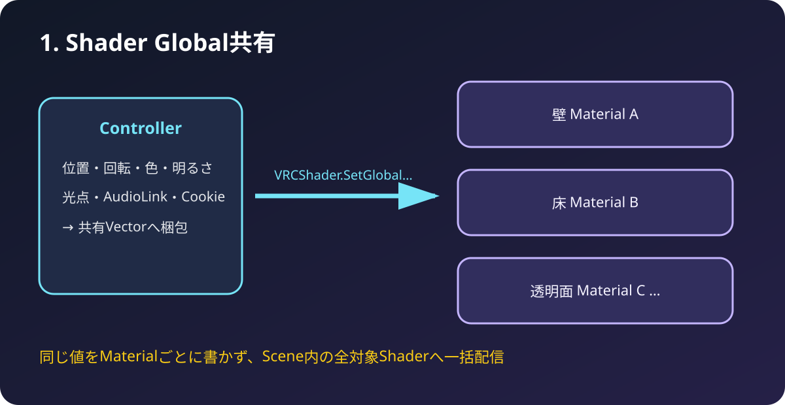
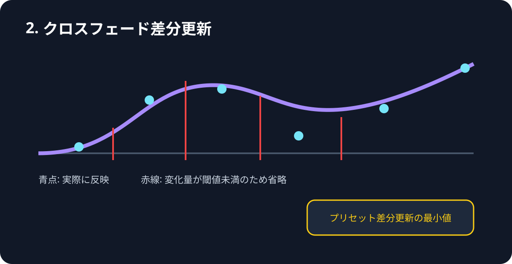
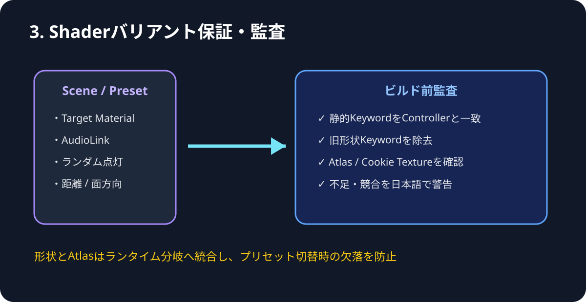
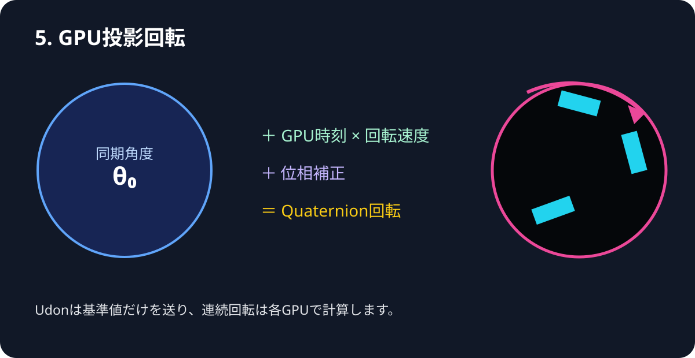
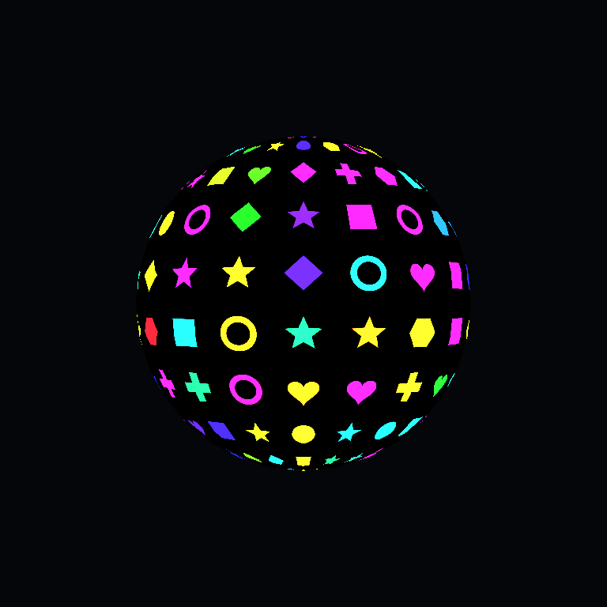
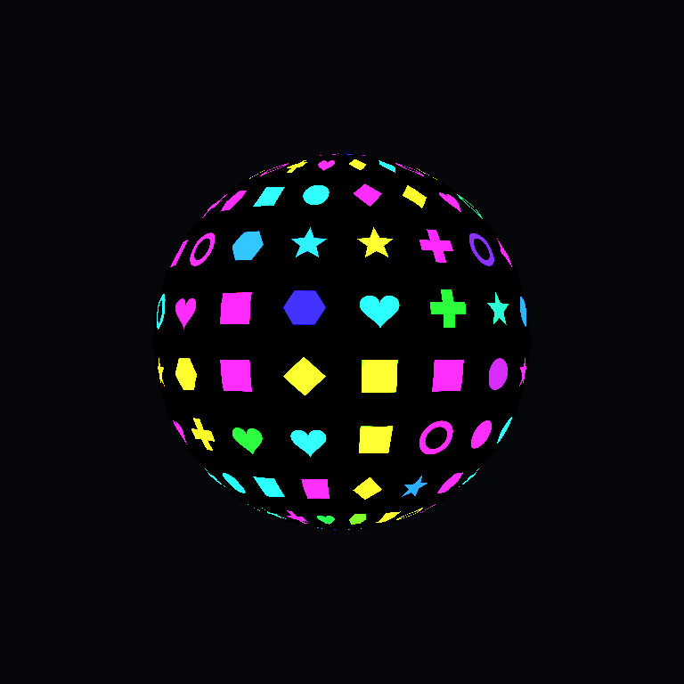
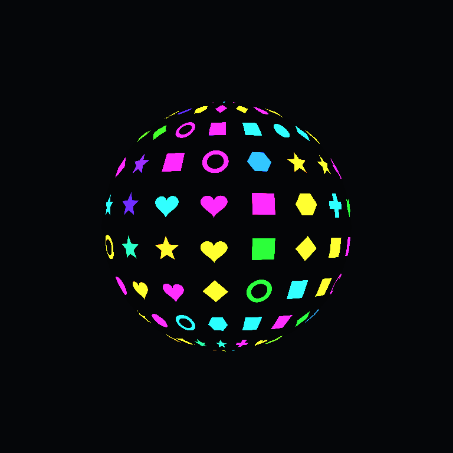
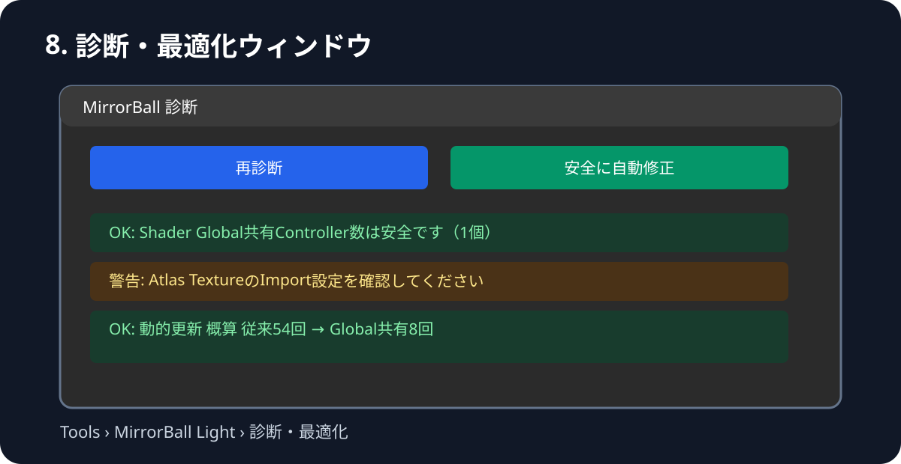

# MirrorBallLightController R22.1 最適化・診断マニュアル

R22系で実装した「1・2・3・5・8」の機能を、Unity Inspectorの日本語項目と対応させて説明します。オフライン閲覧用の同内容ページは [HTML版](MirrorBallLightController_R22.1_最適化マニュアル.html) です。R22.1ではUnity上の表示名をバージョン非依存に整理しています。

## 最初の設定

1. Controllerの「10. 最適化・診断」を開きます。
2. `Shader Global共有を使用（推奨）` と `投影回転をGPUで計算（推奨）` をONにします。
3. `プリセット差分更新の最小値` は0.001から開始します。
4. `現在の設定をマテリアルへ反映・保存` を押します。
5. `診断・最適化ウィンドウを開く` → `安全に自動修正` を実行します。

> Global共有はScene全体で1系統です。異なる設定のControllerを複数同時に使う場合、主Controller以外はGlobal共有をOFFにしてください。

## 1. Shader Global共有

位置、回転、色、光点、AudioLink、Cookie、Atlasなどを共有Vectorへ梱包し、全R22 Surface Shaderへ一括配信します。6 Materialの場合、動的Setterの概算は従来54回からGlobal共有8回になります。`対象マテリアル` は初回Keyword設定と通常／透過判定に必要なため、Global共有時も削除しません。

## 2. クロスフェード差分更新

前回反映値との差が `プリセット差分更新の最小値` 未満なら、そのフレームの重複更新を省略します。初期値0.001を推奨します。大きくしすぎると低速フェードで段差が見える可能性があります。

## 3. Shaderバリアント保証・監査

Texture形状とAtlas形状をランタイム安全分岐へ統合し、アップロード後のPreset切替で形状が欠落する事故を防ぎます。静的Keywordは診断機能がControllerとMaterialの状態を一致させます。

- 通常版の理論ローカルKeyword組合せ: 64 → 32
- LightVolumes連携版: 128 → 64
- Surface Shaderが自動生成する照明バリアントは別に加算されます。

VRChatアップロード前は、ビルド前フックだけに頼らず診断ウィンドウを手動実行してください。

## 5. GPU投影回転

同期基準角度、回転軸、速度、位相補正からShader内でQuaternion回転を生成します。`表示用ミラーボール本体も回転` をOFFにすると球体Transformを止め、壁面投影だけをGPUで回転できます。

| Inspector表示 | 動作 |
|---|---|
| 投影回転をGPUで計算（推奨） | Global共有と併用してON。OFFなら従来のCPU回転値を使用 |
| 表示用ミラーボール本体も回転 | 球体Meshも回すならON。投影だけならOFF |
| 回転速度／回転軸 | 従来設定をそのまま使用。電源OFF時停止にも対応 |

### Unity 2022.3 実描画テスト

| 位相0度 | 位相90度 | 透過＋LV/LTCGI版 |
|---|---|---|
|  |  |  |

0度と90度の比較で47,992ピクセルの変化を確認し、通常版と透過連携版の両方でGlobal値が反映されています。

## 8. 診断・最適化ウィンドウ

Inspectorの「10. 最適化・診断」、または `Tools > MirrorBall Light > 診断・最適化` から開きます。

- Global Controllerの競合
- Target Materialの重複と対象外Shader
- ControllerとMaterial Keywordの不一致
- 旧方式の形状Keyword
- Atlas、Texture形状、2D／Cubemap Cookieの未設定
- Atlas容量とTexture Import設定
- 従来方式とGlobal共有方式の動的Setter概算

`安全に自動修正` は対応KeywordとAtlasの `Clamp / MipMap OFF / Alpha Is Transparency ON` だけを修正します。参照オブジェクトの置換やPreset削除は行いません。

## サンプルTexture

今回の5機能は最適化・診断機能のため、新しい専用Textureは不要です。形状と診断の確認には、[4×2サンプル形状Atlas](../assets/ShapeAtlas/SampleShapeAtlas_4x2.png) を使用できます。

## アップロード前チェック

1. 対象マテリアルをシーンから自動検出
2. 現在の設定をマテリアルへ反映・保存
3. 診断画面で「安全に自動修正」
4. Consoleの赤エラーが0であることを確認
5. Play Modeで電源、Presetクロスフェード、GPU回転を確認
6. VRChat Build & Test後にアップロード

問題の切り分け時はGPU回転をOFF、それでも改善しなければGlobal共有もOFFにすると、R21相当のMaterial個別更新へ戻せます。
