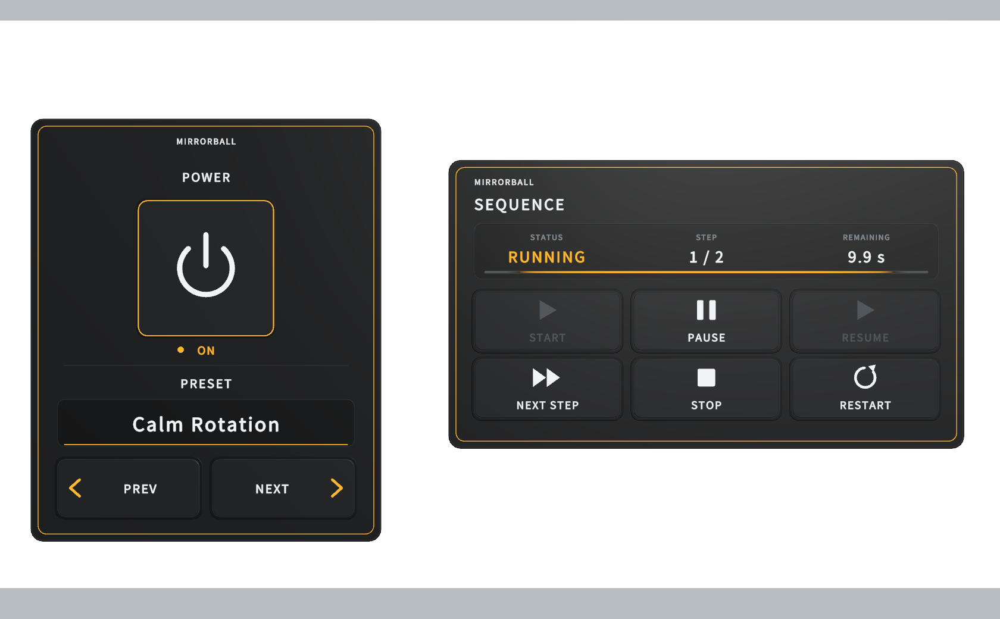

# VRC MirrorBallLight GitHub版マニュアル

[HTML版マニュアル（zip）](https://github.com/BossNovice/VRC_MirrorBallLight_Manual/raw/main/docs_html.zip)

> **このページは現行版だけを扱います。** 過去の版のマニュアルは `archive/` にあります。

## Lighting Engineと用途別描画

実際の壁・床・天井へ反射を配置するLighting Engineと、描画先（通常・鏡・撮影）ごとの品質設定があります。Lighting Engineは任意で、導入しなければ受光面Shaderだけで描画します。

**遮蔽だけが目的なら、Lighting Engineより先に遮蔽キューブマップを検討してください。** 受光面Shaderの見た目はそのままに、ボールの中心から見た最寄りの面までの距離をキューブマップへ焼き、柱・カウンター・梁の裏に光点を出さなくします（**Tools → MirrorBall Light → 遮蔽キューブマップを焼く**。静的な遮蔽物だけが対象で、アバターや動く物は遮りません。ボールや遮蔽物を動かしたら焼き直しが要り、診断が MBL-W035／W036 で知らせます）。Lighting Engineはスポットライトからの反射を実際に追う物理反射の見た目で、光源がボールの真上に無いと光点の回転の中心が真上からずれます（実物と同じ）。[遮蔽キューブマップ](../docs/03_apply.html#occlusion)を参照してください。

1. 実形状へ反射を配置する場合は **Tools → MirrorBall Light → Lighting Engineを導入** でControllerと受光対象の階層を選び、検出一覧のFloor／Wall／Ceiling／Stage／Objects／Avatar分類と対象チェックを修正して適用します。ball、入射Spot、Receiver Manager、InstancedSpot MaterialのGPU Instancing、有効な非Trigger Colliderを確認します。登録外の遮蔽物もRaycast Layerへ含めてください。[自分の壁へ適用する](../docs/03_apply.html#lighting-engine)に詳細があります。
   - **一覧の対象へLighting Engineを設定** はボールのメッシュへ球を当てはめ、球面上の外向きの三角形だけを反射Facetにします。同じメッシュの鎖や吊り金具、面積0の三角形は除外します。主に球でない形状は、すべての三角形をFacetにします。上限は8192個で、超える分は均等に間引きます。結果欄の例:「反射Facet 8192個を登録。ボールMeshの三角形 17156個のうち、鎖など球面から外れた三角形・面積0の三角形 508個を除外しました。上限8192個まで均等に間引いています。」最後の一文は間引いたときだけ出ます。[Facet選別](../docs/03_apply.html#engine-facets)を参照してください。
   - Setupはシーンのprogramの名前が「AudioLink」のUdonBehaviourを探してEngineの `audioLinkBehaviour` へつなぎ、`requestAudioLinkReadback` を有効にします。設定済みの参照はそのままにします。[AudioLinkの自動接続](../docs/03_apply.html#engine-audiolink-wiring)を参照してください。
   - 鏡（`VRCMirrorReflection`）・動画スクリーン（`VideoPlayer`・VRChatの動画プレイヤー）・テキスト（`TextMesh`・`TextMeshPro`）・RenderTextureを表示する画面・EditorOnlyタグの下の物・半透明と加算のMaterial（Render Queue 3000以上）は、チェックが外れた状態で一覧に出ます。行の下に「自動除外：鏡（VRC Mirror）。受光させる場合はチェックを入れてください。」のように理由が出ます。チェックを入れれば登録できます。チェックの外れた対象は登録せず、Colliderも追加しません。検出時と適用後の結果欄には「除外 鏡（VRC Mirror）：1個」「除外 動画スクリーン（VideoPlayer・VRC動画プレイヤー）：1個」「除外 テキスト（TextMesh・TextMeshPro）：2個」「除外 半透明・加算のMaterial（Render Queue 3000以上）：1個」のように理由ごとの件数が出ます。自分で外した対象は「除外 手動で除外」、一覧に出ないパーティクル・ライン等は「除外 パーティクル・ライン等のメッシュ以外のRenderer：4個（一覧に表示しません）」と数えます。[自動で除外される対象](../docs/03_apply.html#engine-exclusions)を参照してください。
   - Setupは登録するRendererごとに受光面の色を記録します。1つ目のMaterialの `_Color` と、メッシュが実際に使うUV範囲のメインテクスチャの平均を掛けた色です。テクスチャやメッシュのRead/WriteがOFFでも測れますが、グラフィックスありのEditorが必要です。Engineは光点に当たった面の色を掛けます。シーンのライティングには左右されず、暗いMaterialでは光点が暗く、色の付いたMaterialでは光点にその色が付きます。Engine Inspectorの **受光面の色の影響**（`receiverColorInfluence`、0〜1、既定1）を0にすると白い光点になります。色を記録していない対象（色の記録が入る前に導入したシーンなど）は白で描かれ、Engine Inspectorに「受光面の色が未登録の対象があります（白で表示されます）。受光対象の登録を開き、「一覧の対象へLighting Engineを設定」をもう一度実行してください。」と出ます。[受光面の色](../docs/03_apply.html#engine-surface-color)を参照してください。
   - Engineの光点はControllerの **光点の形状**（内蔵形状・光点形状テクスチャ・複数形状アトラス）で描きます。既定は「四角」です。丸い光点にするにはControllerで「丸」を選び、**複数形状アトラスを使用** をOFFにします（受光面Shaderの光点も同じ形になります）。形状が「丸」以外のとき、または複数形状アトラスを使用しているときは、Engine Inspectorに案内が出ます。**光点アンチエイリアス** はEngineの内蔵形状で輪郭をぼかす幅（約1〜2画素）として効きます。Engineの光点は一定の大きさで、斜めの面でも引き伸ばされません。[光点の形状](../docs/03_apply.html#engine-spot-shape)を参照してください。
2. ControllerのBasic／Advanced／Debugで調整・詳細設定・Scene補助を使い分けます。Auto PerformanceはGraphics設定の読取で、GPU/FPSの測定ではありません。通常／Mirror／Face Mirror／Handheld／Screenshotの密度初期値は100／50／25／125／150%。Mirror／Face Mirror／Handheld／Screenshotの履歴サンプル予算は固定値（1／1／48／48）で、設定項目はありません。Temporal Sparkle StabilityはRenderTextureを使わない解析的近似です。[Controller](../docs/04_controller.html#three-mode)と[回転・安定化](../docs/05_motion.html#engine-motion)を参照してください。
3. Engineの品質はLOW32／MED64／HIGH128／ULTRA256／OFF0。PhotoCameraがActiveかつPhoto Mode有効のPCでは配置512を使えますが、撮影slotは通常・鏡へ増やさず、OFFは復活しません。撮影カメラを開いている間も、通常の画面の光点の更新間隔と寿命は変わりません。AndroidはLOW／OFFです。[品質とProfiler](../docs/19_heavy.html#engine-quality)を参照してください。
4. Audio反応はBassサイズ／Mid回転／High密度／Beat Flash。7ジャンルNORMAL／CLUB／HIPHOP／HOUSE／TECHNO／DISCO／CHILLと、7回転Constant／Accelerate／Decelerate／BeatSync／Pendulum／ReverseBeat／RandomAccentを選べます。BPM・位相は明示値です。AudioLinkは導入ウィンドウが自動でつなぎます（上の1）。[Audio](../docs/12_audiolink.html#engine-audio)を参照してください。
5. Engine Inspectorの **現在の演出をAssetへ保存** と **保存した演出を読み込む** で演出値を扱います。ローカル品質・対象参照・Ray予算・受光面の色の影響は保存しません。CPU更新時間とRay数・有効光点はGPU負荷やVRChat実機FPSとは別に読みます。当たったColliderの受光グループはRayごとに1回の辞書検索で探すため、登録した受光対象が多くても遅くなりません。CPUの目安（Unity Editorでの計測）: Unity EditorのPlay Mode（Udon VM、1人）で、品質ULTRA（256光点）・24 rays・毎秒30回更新・Facet 8,192個のとき、Engineの1フレームの平均は約1.1 msでした。Editorでの計測で、VRChatクライアントのCPUは計測していません。[演出Asset](../docs/13_presets.html#engine-preset)を参照してください。

## 動作確認済みの組み合わせ

確認の種類を分けて記載しています。**コンパイル確認と実機での見え方は別のもの**です。

| MirrorBallLight | Unity | VRCLightVolumes | LTCGI | コンパイル確認 | 実機目視（PC） |
| --- | --- | --- | --- | --- | --- |
| R37.5 | 2022.3.22f1 | 3.0.0-dev.20 | 1.7.3 | 済（注55） | 未実施（注55） |
| R37.5 | 2022.3.22f1 | 3.0.0-dev.15 | 1.7.3 | Shaderのみ（注55） | 未実施（注55） |
| R37.5 | 2022.3.22f1 | 2.1.3 | 1.7.2 | Shaderのみ（注55） | 未実施（注55） |
| R37.5 | 2022.3.22f1 | 未導入 | 未導入 | 未実施（注55） | 未実施（注55） |
| R37.4 | 2022.3.22f1 | 3.0.0-dev.20 | 1.7.3 | 済（注54） | 未実施（注54） |
| R37.4 | 2022.3.22f1 | 3.0.0-dev.15 | 1.7.3 | Shaderのみ（注54） | 未実施（注54） |
| R37.4 | 2022.3.22f1 | 2.1.3 | 1.7.2 | Shaderのみ（注54） | 未実施（注54） |
| R37.4 | 2022.3.22f1 | 未導入 | 未導入 | 未実施（注54） | 未実施（注54） |
| R37.3 | 2022.3.22f1 | 3.0.0-dev.20 | 1.7.3 | 済（注53） | 未実施（注53） |
| R37.3 | 2022.3.22f1 | 3.0.0-dev.15 | 1.7.3 | Shaderのみ（注53） | 未実施（注53） |
| R37.3 | 2022.3.22f1 | 2.1.3 | 1.7.2 | Shaderのみ（注53） | 未実施（注53） |
| R37.3 | 2022.3.22f1 | 未導入 | 未導入 | 未実施（注53） | 未実施（注53） |
| R37.2 | 2022.3.22f1 | 3.0.0-dev.20 | 1.7.3 | 済（注52） | 未実施（注52） |
| R37.2 | 2022.3.22f1 | 3.0.0-dev.15 | 1.7.3 | Shaderのみ（注52） | 未実施（注52） |
| R37.2 | 2022.3.22f1 | 2.1.3 | 1.7.2 | Shaderのみ（注52） | 未実施（注52） |
| R37.2 | 2022.3.22f1 | 未導入 | 未導入 | 未実施（注52） | 未実施（注52） |
| R37.1 | 2022.3.22f1 | 3.0.0-dev.20 | 1.7.3 | 済（注51） | 未実施（注51） |
| R37.1 | 2022.3.22f1 | 3.0.0-dev.15 | 1.7.3 | Shaderのみ（注51） | 未実施（注51） |
| R37.1 | 2022.3.22f1 | 2.1.3 | 1.7.2 | Shaderのみ（注51） | 未実施（注51） |
| R37.1 | 2022.3.22f1 | 未導入 | 未導入 | 未実施（注51） | 未実施（注51） |
| R37 | 2022.3.22f1 | 3.0.0-dev.21 | 1.7.3 | Shaderのみ（注49） | 未実施（注49） |
| R37 | 2022.3.22f1 | 3.0.0-dev.20 | 1.7.3 | 済（注49） | 未実施（注49） |
| R37 | 2022.3.22f1 | 3.0.0-dev.15 | 1.7.3 | Shaderのみ（注49） | 未実施（注49） |
| R37 | 2022.3.22f1 | 2.1.3 | 1.7.2 | Shaderのみ（注49） | 未実施（注49） |
| R37 | 2022.3.22f1 | 未導入 | 未導入 | 未実施（注49） | 未実施（注49） |
| R36.1 | 2022.3.22f1 | 3.0.0-dev.21 | 1.7.3 | Shaderのみ（注48） | 済（注50） |
| R36.1 | 2022.3.22f1 | 3.0.0-dev.20 | 1.7.3 | 済（注47） | 未実施（注47） |
| R36.1 | 2022.3.22f1 | 3.0.0-dev.15 | 1.7.3 | Shaderのみ（注47） | 未実施（注47） |
| R36.1 | 2022.3.22f1 | 2.1.3 | 1.7.2 | Shaderのみ（注47） | 未実施（注47） |
| R36.1 | 2022.3.22f1 | 未導入 | 未導入 | 未実施（注47） | 未実施（注47） |
| R36 | 2022.3.22f1 | 3.0.0-dev.20 | 1.7.3 | 済（注46） | 未実施（注46） |
| R36 | 2022.3.22f1 | 3.0.0-dev.15 | 1.7.3 | Shaderのみ（注46） | 未実施（注46） |
| R36 | 2022.3.22f1 | 2.1.3 | 1.7.2 | Shaderのみ（注46） | 未実施（注46） |
| R36 | 2022.3.22f1 | 未導入 | 未導入 | 未実施（注46） | 未実施（注46） |
| R35 | 2022.3.22f1 | 3.0.0-dev.20 | 1.7.3 | 済（注45） | 未実施（注45） |
| R35 | 2022.3.22f1 | 3.0.0-dev.15 | 1.7.3 | Shaderのみ（注45） | 未実施（注45） |
| R35 | 2022.3.22f1 | 2.1.3 | 1.7.2 | Shaderのみ（注45） | 未実施（注45） |
| R35 | 2022.3.22f1 | 未導入 | 未導入 | 未実施（注45） | 未実施（注45） |
| R34.1 | 2022.3.22f1 | 3.0.0-dev.20 | 1.7.3 | 済（注44） | 構成は未記録（注44） |
| R34.1 | 2022.3.22f1 | 3.0.0-dev.15 | 1.7.3 | Shaderのみ（注44） | 構成は未記録（注44） |
| R34.1 | 2022.3.22f1 | 2.1.3 | 1.7.2 | Shaderのみ（注44） | 構成は未記録（注44） |
| R34.1 | 2022.3.22f1 | 未導入 | 未導入 | 未実施（注44） | 構成は未記録（注44） |
| R34.1 | 2022.3.22f1 | 実機確認時の版は未記録 | 実機確認時の版は未記録 | ― | 済（注44） |
| R34 | 2022.3.22f1 | 2.1.3 | 1.7.2 | 済（注43） | 未実施（注43） |
| R34 | 2022.3.22f1 | 3.0.0-dev.15 | 1.7.3 | 済（注43） | 未実施（注43） |
| R34 | 2022.3.22f1 | 未導入 | 未導入 | 済（UdonSharpのみ、注43） | 未実施（注43） |
| R33 | 2022.3.22f1 | 2.1.3 | 1.7.2 | 済（注42） | 未実施（注42） |
| R33 | 2022.3.22f1 | 3.0.0-dev.15 | 1.7.3 | 済（注42） | 未実施（注42） |
| R33 | 2022.3.22f1 | 未導入 | 未導入 | 済（注42） | 未実施（注42） |
| R32.7 | 2022.3.22f1 | 3.0.0-dev.20 | 1.7.3 | 済（注41） | 未実施（注41） |
| R32.6 | 2022.3.22f1 | 2.1.3 | 1.7.2 | 済（注40） | 未実施（注40） |
| R32.6 | 2022.3.22f1 | 3.0.0-dev.15 | 1.7.3 | 済（注40） | 未実施（注40） |
| R32.6 | 2022.3.22f1 | 未導入 | 未導入 | 済（注40） | 未実施（注40） |
| R32.5 | 2022.3.22f1 | 2.1.3 | 1.7.2 | 済（注39） | 未実施（注39） |
| R32.5 | 2022.3.22f1 | 3.0.0-dev.15 | 1.7.3 | 済（注39） | 未実施（注39） |
| R32.5 | 2022.3.22f1 | 未導入 | 未導入 | 済（注39） | 未実施（注39） |
| R32.4 | 2022.3.22f1 | 2.1.3 | 1.7.2 | 済（注38） | 未実施（注38） |
| R32.4 | 2022.3.22f1 | 3.0.0-dev.15 | 1.7.3 | 済（注38） | 未実施（注38） |
| R32.4 | 2022.3.22f1 | 未導入 | 未導入 | 済（注38） | 未実施（注38） |
| R32.3 | 2022.3.22f1 | 2.1.3 | 1.7.2 | 済（注37） | 未実施（注37） |
| R32.3 | 2022.3.22f1 | 3.0.0-dev.15 | 1.7.3 | 済（注37） | 未実施（注37） |
| R32.3 | 2022.3.22f1 | 未導入 | 未導入 | 済（注37） | 未実施（注37） |
| R32.2 | 2022.3.22f1 | 2.1.3 | 1.7.2 | 済（注36） | 未実施（注36） |
| R32.2 | 2022.3.22f1 | 3.0.0-dev.15 | 1.7.3 | 済（注36） | 未実施（注36） |
| R32.2 | 2022.3.22f1 | 未導入 | 未導入 | 済（注36） | 未実施（注36） |
| R32.1 | 2022.3.22f1 | 2.1.3 | 1.7.2 | 済（注35） | 未実施（注35） |
| R32.1 | 2022.3.22f1 | 3.0.0-dev.15 | 1.7.3 | 済（注35） | 未実施（注35） |
| R32.1 | 2022.3.22f1 | 未導入 | 未導入 | 済（注35） | 未実施（注35） |
| R32 | 2022.3.22f1 | 2.1.3 | 1.7.2 | 済（注34） | 未実施（注34） |
| R32 | 2022.3.22f1 | 3.0.0-dev.15 | 1.7.3 | 済（注34） | 未実施（注34） |
| R32 | 2022.3.22f1 | 未導入 | 未導入 | 済（注34） | 未実施（注34） |
| R31 | 2022.3.22f1 | 2.1.3 | 1.7.2 | 済（注33） | 未実施（注33） |
| R31 | 2022.3.22f1 | 3.0.0-dev.15 | 1.7.3 | 済（注33） | 未実施（注33） |
| R31 | 2022.3.22f1 | 未導入 | 未導入 | 済（注33） | 未実施（注33） |
| R30.20 | 2022.3.22f1 | 2.1.3 | 1.7.2 | 済 | 対象外（注32） |
| R30.20 | 2022.3.22f1 | 3.0.0-dev.15 | 1.7.3 | 済（注1） | 対象外（注32） |
| R30.20 | 2022.3.22f1 | 未導入 | 未導入 | 済（注2） | 対象外（注32） |
| R30.20 | 2022.3.22f1 | 確認時の構成は未記録 | 確認時の構成は未記録 | ― | 利用者報告（注32） |
| R30.19 | 2022.3.22f1 | 2.1.3 | 1.7.2 | 済 | 対象外（注31） |
| R30.19 | 2022.3.22f1 | 3.0.0-dev.15 | 1.7.3 | 済（注1） | 対象外（注31） |
| R30.19 | 2022.3.22f1 | 未導入 | 未導入 | 済（注2） | 対象外（注31） |
| R30.18 | 2022.3.22f1 | 2.1.3 | 1.7.2 | 済 | 済（注30） |
| R30.18 | 2022.3.22f1 | 3.0.0-dev.15 | 1.7.3 | 済（注1） | 済（注30） |
| R30.18 | 2022.3.22f1 | 未導入 | 未導入 | 済（注2） | 済（注30） |
| R30.17 | 2022.3.22f1 | 2.1.3 | 1.7.2 | 済 | 対象外（注29） |
| R30.17 | 2022.3.22f1 | 3.0.0-dev.15 | 1.7.3 | 済（注1） | 対象外（注29） |
| R30.17 | 2022.3.22f1 | 未導入 | 未導入 | 済（注2） | 対象外（注29） |
| R30.16 | 2022.3.22f1 | 2.1.3 | 1.7.2 | 済 | 対象外（注28） |
| R30.16 | 2022.3.22f1 | 3.0.0-dev.15 | 1.7.3 | 済（注1） | 対象外（注28） |
| R30.16 | 2022.3.22f1 | 未導入 | 未導入 | 済（注2） | 対象外（注28） |
| R30.15 | 2022.3.22f1 | 2.1.3 | 1.7.2 | 済 | 済（注27） |
| R30.15 | 2022.3.22f1 | 3.0.0-dev.15 | 1.7.3 | 済（注1） | 済（注27） |
| R30.15 | 2022.3.22f1 | 未導入 | 未導入 | 済（注2） | 済（注27） |
| R30.14 | 2022.3.22f1 | 2.1.3 | 1.7.2 | 一部のみ（注26） | 済（注26） |
| R30.14 | 2022.3.22f1 | 3.0.0-dev.15 | 1.7.3 | 一部のみ（注26） | 済（注26） |
| R30.14 | 2022.3.22f1 | 未導入 | 未導入 | 一部のみ（注26） | 済（注26） |
| R30.13 | 2022.3.22f1 | 2.1.3 | 1.7.2 | 一部のみ（注25） | 対象外（注25） |
| R30.13 | 2022.3.22f1 | 3.0.0-dev.15 | 1.7.3 | 一部のみ（注25） | 対象外（注25） |
| R30.13 | 2022.3.22f1 | 未導入 | 未導入 | 一部のみ（注25） | 対象外（注25） |
| R30.12 | 2022.3.22f1 | 2.1.3 | 1.7.2 | 一部のみ（注24） | 対象外（注24） |
| R30.12 | 2022.3.22f1 | 3.0.0-dev.15 | 1.7.3 | 一部のみ（注24） | 対象外（注24） |
| R30.12 | 2022.3.22f1 | 未導入 | 未導入 | 一部のみ（注24） | 対象外（注24） |
| R30.11 | 2022.3.22f1 | 2.1.3 | 1.7.2 | 一部のみ（注23） | 対象外（注23） |
| R30.11 | 2022.3.22f1 | 3.0.0-dev.15 | 1.7.3 | 一部のみ（注23） | 対象外（注23） |
| R30.11 | 2022.3.22f1 | 未導入 | 未導入 | 一部のみ（注23） | 対象外（注23） |
| R30.10 | 2022.3.22f1 | 2.1.3 | 1.7.2 | 一部のみ（注22） | 未実施（注22） |
| R30.10 | 2022.3.22f1 | 3.0.0-dev.15 | 1.7.3 | 一部のみ（注22） | 未実施（注22） |
| R30.10 | 2022.3.22f1 | 未導入 | 未導入 | 一部のみ（注22） | 未実施（注22） |
| R30.9 | 2022.3.22f1 | 2.1.3 | 1.7.2 | 一部のみ（注21） | 未実施（注21） |
| R30.9 | 2022.3.22f1 | 3.0.0-dev.15 | 1.7.3 | 一部のみ（注21） | 未実施（注21） |
| R30.9 | 2022.3.22f1 | 未導入 | 未導入 | 一部のみ（注21） | 未実施（注21） |
| R30.8 | 2022.3.22f1 | 2.1.3 | 1.7.2 | 済 | 未実施（注20） |
| R30.8 | 2022.3.22f1 | 3.0.0-dev.15 | 1.7.3 | 済（注1） | 未実施（注20） |
| R30.8 | 2022.3.22f1 | 未導入 | 未導入 | 済（注2） | 未実施（注20） |
| R30.7 | 2022.3.22f1 | 2.1.3 | 1.7.2 | 済 | 実施しません（注19） |
| R30.7 | 2022.3.22f1 | 3.0.0-dev.15 | 1.7.3 | 済（注1） | 実施しません（注19） |
| R30.7 | 2022.3.22f1 | 未導入 | 未導入 | 済（注2） | 実施しません（注19） |
| R30.6 | 2022.3.22f1 | 2.1.3 | 1.7.2 | 済 | 実施しません（注18） |
| R30.6 | 2022.3.22f1 | 3.0.0-dev.15 | 1.7.3 | 済（注1） | 実施しません（注18） |
| R30.6 | 2022.3.22f1 | 未導入 | 未導入 | 済（注2） | 実施しません（注18） |
| R30.5 | 2022.3.22f1 | 2.1.3 | 1.7.2 | 済 | 未実施（注17） |
| R30.5 | 2022.3.22f1 | 3.0.0-dev.15 | 1.7.3 | 済（注1） | 未実施（注17） |
| R30.5 | 2022.3.22f1 | 未導入 | 未導入 | 済（注2） | 未実施（注17） |
| R30.4 | 2022.3.22f1 | 2.1.3 | 1.7.2 | 済 | 対象外（注16） |
| R30.4 | 2022.3.22f1 | 3.0.0-dev.15 | 1.7.3 | 済（注1） | 対象外（注16） |
| R30.4 | 2022.3.22f1 | 未導入 | 未導入 | 済（注2） | 対象外（注16） |
| R30.3 | 2022.3.22f1 | 2.1.3 | 1.7.2 | 済 | 対象外（注15） |
| R30.3 | 2022.3.22f1 | 3.0.0-dev.15 | 1.7.3 | 済（注1） | 対象外（注15） |
| R30.3 | 2022.3.22f1 | 未導入 | 未導入 | 済（注2） | 対象外（注15） |
| R30.2 | 2022.3.22f1 | 2.1.3 | 1.7.2 | 済 | 済（注14） |
| R30.2 | 2022.3.22f1 | 3.0.0-dev.15 | 1.7.3 | 済（注1） | 済（注14） |
| R30.2 | 2022.3.22f1 | 未導入 | 未導入 | 済（注2） | 済（注14） |
| R30.1 | 2022.3.22f1 | 2.1.3 | 1.7.2 | 済 | 済（注13） |
| R30.1 | 2022.3.22f1 | 3.0.0-dev.15 | 1.7.3 | 済（注1） | 済（注13） |
| R30.1 | 2022.3.22f1 | 未導入 | 未導入 | 済（注2） | 済（注13） |
| R30 | 2022.3.22f1 | 2.1.3 | 1.7.2 | 済 | 済（注11） |
| R30 | 2022.3.22f1 | 3.0.0-dev.15 | 1.7.3 | 済（注1） | 済（注11） |
| R30 | 2022.3.22f1 | 未導入 | 未導入 | 済（注2） | 対象外（注12） |
| R29.6 | 2022.3.22f1 | 2.x相当 | 1.7.2 | 済 | 済（注10） |
| R29.6 | 2022.3.22f1 | 3.0.0-dev.15 | 1.7.3 | 済（注1） | 済（注10） |
| R29.6 | 2022.3.22f1 | 未導入 | 未導入 | 済（注2） | 済（注10） |
| R29.5 | 2022.3.22f1 | 2.x相当 | 1.7.2 | 済 | 対象外（注9） |
| R29.5 | 2022.3.22f1 | 3.0.0-dev.15 | 1.7.3 | 済（注1） | 対象外（注9） |
| R29.5 | 2022.3.22f1 | 未導入 | 未導入 | 済（注2） | 対象外（注9） |
| R29.5 | 2022.3.22f1 | 実機確認時の版は未記録 | 実機確認時の版は未記録 | ― | 済（注9） |

- **コンパイル確認**: Unityバッチモードで、UdonSharpの変換とShaderのコンパイルにエラーが出ないことを確認した結果です
- **実機目視**: VRChat（PC）で代表的なシーンを目視確認した結果です。**全機能を網羅した確認ではありません**
- **未実施**: 確認していません。**問題が無いことを確認した、という意味ではありません**

- **注2**: 連携版Shader3本は LTCGI・VRCLightVolumes を無条件にincludeするため、
  **未導入の環境では必ずコンパイルエラーになります。これは設計どおりです。**
  連携版を使う場合は、MirrorBallLightより先に両パッケージを導入してください。
  ここでの「済」は、**通常版Shader3本にエラーが無く、連携版3本のエラーがinclude不在
  だけに由来する**ことを確認したという意味です。連携パッケージを外したUnityプロジェクトで
  実測しました。

- **注9**: R29.5 は利用者のVRChat（PC）実機確認で問題なしとの報告を受けています。
  ただし確認時のVRCLightVolumes／LTCGIの版は記録されていないため、実機結果を特定の連携版へ
  紐付けず別行に記録しています。上の3行の実機欄は重複記録を避けるため対象外です。
  実機目視は代表的なシーンの確認であり、全機能を網羅しません。

- **注10**: R29.6はUnity Edit ModeでUI Button／UI Bridge生成、Controller・操作参照、
  backing UdonBehaviour、On Click配線、再設定時のListener非重複まで確認しています。
  ClientSimの既存Bridge実行検査25件も通過しています。
  2026-08-31に、**上の3構成すべてのVRChat PCクライアントで、自動作成したButtonを実際に
  押す確認まで行い、問題なしとの報告を受けています。**
  この機能はR30にもそのまま入っています。実機目視は代表的なシーンの確認であり、
  全機能を網羅しません。

- **注11**: R30は両連携構成でShader 6本、UdonSharp、ビルド時バリアントを検証し、
  Unityスタンドアロンの描画検査50シナリオ／39差分組を通過しています。
  2026-08-31に、**両連携構成のVRChat PCクライアントで[実機確認: R30の照明連携](実機確認_R30照明連携.md)
  の7ケースをすべて実施し、問題なしとの報告を受けています。**
  合成方式4つの比較、スペキュラ方式（なし／主方向のみ／RGB方向別）、AudioLink動作中の
  明るさ、Additive Light Volume専用受光までです。Additiveのみは、実際にAdditive Light Volumeを
  置いたワールドで内側と外側の差を確認しています。
  実機目視は代表的なシーンの確認であり、全機能を網羅しません。

- **注33**: R31の完全リリース検証は56項目すべて成功しました（未実施・スキップ0件）。Unity 2022.3.22f1で両連携構成のEditor C#・実Udonコンパイルを確認し、Easy / Pro 23項目、プリセット31項目、ウィザード18項目、シーケンス24項目が各構成で成功しました。未導入構成では通常版Shaderの成功と、連携版3本のinclude不在による想定内失敗を確認しています。
  実Playerの描画比較は91場面すべて成功し、基準不足・問題は0件です。ClientSimでは両連携構成の実Udon実行45項目が成功しました。配布候補unitypackageの新規Importと2回目起動も確認しています。
  ClientSimはVRChat SDKのシミュレーターであり、VRChat実クライアントや複数人での同期確認とは異なります。
  LV3のAudioLink連携を含む実Udon確認ではAudioLink 3.1.2を導入しています。

- **注34**: R32の実Editor C#・実Udonコンパイルを、Unity 2022.3.22f1の両連携構成で確認しています。製品Shader 6本にエラーはなく、Prefab／Material／Texture参照18件に参照切れはありません。未導入構成でも実Udonと参照12件を確認し、通常版が正常、連携版3本はinclude不在による想定内失敗です。 最終パネル仕様で省略なしのリリース検証64項目すべて合格、両連携構成の実Editor検査63項目・パネル描画3場面、両構成の実Udon ClientSim 77項目、故障注入4ケース、変更していないPlayer描画基準91場面、新規Importと2回目起動を確認しました。パネルInspectorもLocal／Global／混在の5状態でLayout／Repaintが成功し、描画による設定変更はありません。
  シーケンス編集・比較・ウィザードの実OnGUI検査で、Layout／Repaintと設定保持も確認しています。パネル画像は実PrefabのEditor描画であり、VRChat実機の画面ではありません。
  VRChat実クライアントの複数人・途中参加・Desktop／VRポインター操作は未実施で、追跡ID R31-UNEXEC-01を継続しています。

- **注35**: R32.1は省略なしの完全リリース検証64項目すべてに合格しました（失敗・未実施・スキップ0件）。Unity 2022.3.22f1で両連携構成の実Editor C#・実Udonコンパイル、製品Shader 6本、Prefab／Material／Texture参照18件を確認しています。実Editorのパネル検査63項目と、電源ON／OFF・日本語プリセット名・シーケンス一時停止／実行の実Prefab描画5場面が、各構成で成功しました。
  両連携構成の実Udon ClientSim 77項目、故障注入4ケース、変更していない基準に対する新規Playerビルドの描画比較91場面、新規Importと2回目起動を確認しました。未導入構成では実Udonと参照12件が正常で、連携版Shader 3本だけがinclude不在で想定どおり失敗しています。
  既存のAsset GUID、Shaderソース、Controller／Preset／UI Bridge／SequenceのRuntimeソース、パネルの公開フィールドとイベントを保持しています。パネル画像は実PrefabのEditor描画です。ClientSimとPlayerの検査はVRChat実クライアントの目視・複数人同期・途中参加・Desktop／VRポインター操作の確認とは異なり、追跡ID R31-UNEXEC-01を継続しています。

- **注36**: R32.2は省略なしの完全リリース検証64項目すべてに合格しました（失敗・未実施・スキップ0件）。Unity 2022.3.22f1で両連携構成の実Editor C#・実Udonコンパイル、製品Shader 6本、Prefab／Material／Texture参照18件を確認しています。両パネルのCollider中心のみを物理距離1cm前へ移し、厚み・外観・設置位置を維持しました。縮小・標準・拡大配置で壁の遮蔽を再現し、移動後のPhysics raycast、実SDKのUIフィルター、SDK Use入力から実ボタンを経由するUdon状態変更を確認しています。実Editorのパネル検査87項目と、電源ON／OFF・日本語プリセット名・シーケンス一時停止／実行の実Prefab描画5場面が、各構成で成功しました。
  両連携構成の実Udon ClientSim 101項目、故障注入4ケース、変更していない基準に対する新規Playerビルドの描画比較91場面、新規Importと2回目起動を確認しました。未導入構成では実Udonと参照12件が正常で、連携版Shader 3本だけがinclude不在で想定どおり失敗しています。
  既存のAsset GUID、Shaderソース、Controller／Preset／UI Bridge／SequenceのRuntimeソース、パネルの公開フィールドとイベントを保持しています。パネル画像は実PrefabのEditor描画です。ClientSimとPlayerの検査はVRChat実クライアントの目視・複数人同期・途中参加・Desktop／VRポインター操作の確認とは異なり、追跡ID R31-UNEXEC-01を継続しています。

- **注37**: R32.3は省略なしの完全リリース検証62項目すべてに合格しました（失敗・未実施・スキップ0件）。従来の集計で重複していた資源準備2件を除き、検証範囲は維持しています。Unity 2022.3.22f1で両連携構成の実Editor C#・実Udonコンパイル、製品Shader 6本、Prefab／Material／Texture参照18件を確認しています。前面1cmの当たり判定を引き継ぎ、縮小・標準・拡大配置での壁遮蔽、実SDKのUIフィルターとUse入力による電源・プリセット操作を確認しました。親子Controllerの二重出力抑止、親の無効化・再有効化、現在値54項目によるPreset1の復元、Undo／Redoも確認しました。実EditorのR32検査94項目と実Prefab描画5場面が、各構成で成功しています。
  両連携構成の実Udon ClientSim 111項目、故障注入5ケース、変更していない基準に対する新規Playerビルドの描画比較91場面、新規Importと2回目起動を確認しました。未導入構成では実Udonと参照12件が正常で、連携版Shader 3本だけがinclude不在で想定どおり失敗しています。スタブAPI150メンバの実Unity照合と判定試験13ケースも成功しました。
  既存のAsset GUID、Shaderソース、パネルの外観・設置位置・公開フィールドとイベントを保持しています。パネル画像は実PrefabのEditor描画です。ClientSimとPlayerの検査はVRChat実クライアントの目視・複数人同期・途中参加・Desktop／VRポインター操作の確認とは異なり、追跡ID R31-UNEXEC-01を継続しています。

- **注38**: R32.4は省略なしの完全リリース検証62項目すべてに合格しました（失敗・未実施・スキップ0件）。両連携構成の実Editor C#・実Udonコンパイル、Shader 6本、Prefab／Material／Texture参照18件を確認しています。新規保存は54項目を異なる値にした実Editor fixtureで、Udonへの反映、Texture／Cubemap参照、シーン保存・再読込、既存プリセットと空欄の保持、ライブOFF・電源・操作範囲・選択番号の保持、同名の連番、Undo／Redoを確認しました。実EditorのR32検査109項目が各構成で成功し、Easy／Proの実OnGUI Layout／Repaintでも設定保持を確認しています。
  両連携構成の実Udon ClientSim 111項目、故障注入5ケース、新規Playerビルドの描画比較91場面、新規Importと2回目起動、実Prefabのパネル描画5場面を確認しました。未導入構成は実Udonと参照12件が正常で、連携版Shader 3本のみinclude不在による想定どおりの失敗です。実Unity API150メンバの照合と判定試験13ケースも成功しています。
  設置型パネル・実行時スクリプト・Shader・既存のGUIDや公開フィールド／イベントは変更していません。保存ボタンはUnity Editorでの作成操作です。これらの確認はVRChat実クライアントの複数人・途中参加・実ネットワーク・Desktop／VRポインターの確認とは異なり、追跡ID R31-UNEXEC-01を継続します。

- **注39**: R32.5は省略なしのローカル自動リリース検証64項目すべてに合格しました（失敗・スキップ0）。両連携構成の実Editor C#・Udon・Shader・参照、従来のEditor109項目、実Udon ClientSim111項目、故障注入5ケース、新規Player描画91場面、新規Import・再起動を確認しています。
  新しい作成・管理機能は実Editor54項目を各構成で確認しました。Play ModeからEdit Modeへ戻る実際のドメイン再読み込みをまたぎ、54項目とTexture／Cubemap参照の記録・新規保存、既存設定の保持、Undo／Redo、シーン保存・再読込に成功しています。通常のドメイン再読み込みと無効設定の両方で成功し、並べ替えの参照更新を故意に壊した検証は狙った項目で失敗、復元後は成功しました。名前変更・複製はUdonの値と参照を維持し、並べ替えは無効番号を保持しながら選択・シーケンス・番号指定UI Bridgeを同じ演出へ追従させます。対象外の未保存Materialを保存しないことと、一時プレビューの終了も確認しました。
  Easy／Proの実OnInspectorGUI Layout／Repaintは設定保持とともに成功しています。実行時スクリプト・Shader・設置型パネルと既存GUIDは変更していません。VRChat実クライアントの複数人・途中参加・実ネットワーク・所有者交代・Desktop／VRポインターは別の確認で、追跡ID R31-UNEXEC-01を継続します。

- **注40**: R32.6では、製品Assets・配布文書の同一性を確認し、既存の検証結果を再利用しています。両連携構成の実Unity C#・Udon・全Shader・参照、パネル115項目、設定保存・管理54項目、実Udon ClientSim136項目、新規Player描画91場面、形状GPU検査164項目（共有ON／OFFの28組の描画一致を含む）、連携未導入、新規Import・再起動の成功記録があります。
  初回の一括検証は63成功・1失敗・スキップ0で、失敗は故障注入の旧コード位置でした。注入位置を修正した個別検査で5種類の故障を検出し、復元後にClientSim136項目が成功しました。その後の一括再検証はユーザー指示で中断しています。2026-10-03の検査短縮指示に従い、配布内容・版対応・文書・CIを再確認して公開します。一括再検証の全件成功としては記録していません。
  VRChat実クライアント2人での両操作権限、実ネットワーク伝播、途中参加、所有者交代、Desktop／VR操作、光点形状は未実施です。ClientSimの所有権モック・合成受信と実機を区別し、R31-UNEXEC-01を継続します。

- **注41**: 3Dパネル変更に必要な確認へ絞っています。Blender書き出し、Unity C#・実UdonSharp、実OnClickを使うClientSim31項目、旧パネル2つの更新・Scene保存／再読込、欠損Mesh故障注入2件、104 AssetsのmetaとGUIDを確認しました。World01の実際のLight Volumes 3.0.0-dev.20／LTCGI 1.7.3環境でもC#・Udonコンパイル、新外観と既存設定の保持、壁際の電源・PREV／NEXT判定を確認しています。コンパイル用includeを持つ専用プロジェクトの結果と、実パッケージを持つWorld01を区別しています。
  変更していないShader、プリセット演算、ネットワーク処理はR32.6の実績を参照し、全リリース検査や全連携構成の再検証は繰り返していません。VRChat PC実クライアント・複数人同期は未実施で、R31-UNEXEC-01を継続します。

- **注55**: R37.5はUnity 2022.3.22f1、VRChat SDK 3.10.5で確認しました。3.0.0-dev.20／1.7.3 の構成で、Verify-Release（40項目。実UdonSharpコンパイル、全Shaderのエラー確認、ビルド時Shaderバリアント、サンプラーの余裕、R331描画検査（108項目）、Lighting Engine検査（742項目）、導入ウィンドウ検査（250項目）、Edit Modeの試験（118項目）、Controllerの書き込み結果の突き合わせ、ZIP／unitypackageのビルドとSHA-256）がすべて成功しています。導入ウィンドウ検査では、吊り棒を含む本体の近くの結合した梁とトラックライトが遮蔽物に残ること、凹のMeshColliderの鎖が頂点の距離で「本体に触れている物」になること、1m先のピンスポット器具が遮蔽物に残ること、軸方向6本の照合が本体の吊り棒のColliderを数えないこと、R37.3・R37.4の焼きに MBL-W038 が出ることを確認しました。また、Raycast を正解にShaderの判定をCPUで再現し、56〜80°の床・横倒しの円柱・球・5m先で65°傾いたジャケット・1m先の器具・スラット越しの壁で「誤って消す割合」と「陰の見逃し」を測りました。既定（保守的な2×2・512 px/面）は全受光面で誤って消す 0%、陰の見逃し 5.3%（R37.4の既定の1タップ・256 px/面は最悪の受光面で 2.3% を誤って消し、見逃し 3.9%）です。描画検査（110場面）では、斜め・曲面・形状テクスチャ（Trilinear・異方性・Clamp）の受光面自身を保守的な2×2で焼いても遮蔽なしと画素一致し、1タップでは曲面が一致しないこと、保守的な2×2でも遮蔽物の裏の光点は消えることを確認しました。既存の場面は基準どおりです。3.0.0-dev.15／1.7.3 と 2.1.3／1.7.2 は描画検査でShaderの描画を確認しました。3.0.0-dev.21 と連携未導入構成は確認していません。実機の列は、World01〜03 での実機確認待ちです（焼き直し後の除外内訳・縁の見え方）。
- **注54**: R37.4はUnity 2022.3.22f1、VRChat SDK 3.10.5で確認しました。3.0.0-dev.20／1.7.3 の構成で、Verify-Release（40項目。実UdonSharpコンパイル、全Shaderのエラー確認、ビルド時Shaderバリアント、サンプラーの余裕、R331描画検査（108項目）、Lighting Engine検査（742項目）、導入ウィンドウ検査（236項目）、Edit Modeの試験（118項目）、Controllerの書き込み結果の突き合わせ、ZIP／unitypackageのビルドとSHA-256）がすべて成功しています。導入ウィンドウ検査では、壁・床・天井を1つにまとめた部屋の殻（柱つき、内向きの面）が遮蔽物に入ること、Render Queue 5000 の囲い箱が半透明として除外されること、Box Colliderで囲む箱が囲いとして残ること、子のColliderが近い取り付け具とチェーンが除外されること、焼いた値が0より大きく200m以下で200mの無いこと、軸方向6本の照合が6/6であること、柱・壁・天井が1.85／4／3mで焼かれること、MBL-W036・W038が出ることを確認しました。描画検査（103場面）では、殻と柱を焼いても occlusion と同じ絵になり、6面の中心が殻に当たることを確認しました。3.0.0-dev.15／1.7.3 と 2.1.3／1.7.2 は描画検査でShaderの描画を確認しました。3.0.0-dev.21 と連携未導入構成は確認していません。エディターでの確認（2026-10-06）: World01（部屋の殻 Bace と建物外装を含む）は遮蔽物294、除外は本体・取り付け具1／動く物18／半透明76（夜モードの箱 NightModeCube）。軸方向の照合は3/6で、合わない3本はどれも焼いた値が正しいもの（+X・+Zは Render Queue 3000 の窓ガラスの向こうの屋外、+Yは天井に当たり判定なし）。最大200m、Infinityなし。消えた光点は家具の陰の0〜0.64%、黒い帯0、MBL-W034〜W038なし。World02 は遮蔽物255、除外38（本体・取り付け具4／動く物15／半透明19）。部屋の殻と額縁は遮蔽物に入り、照合は5/6（+Xは BackBar の Box Collider がメッシュより奥にある World02 側の差）。Infinity・NaN・0・200mなし。レイ4000本の検証で、アトラスとレイの一致97.8%、見える面が可視98.6%、遮蔽物の裏が遮蔽90.3%（漏れはスツールやテーブルの脚など細い物の裏のみ）。10視点の比較で明るくなった画素0、黒抜けなし。ただし World02 では、本体の近くの梁とトラックライトが「本体に触れている物」として除外されたままで（R37.5 で修正）、梁の陰の光点は遮られません。実機の列は、World01〜03 での実機確認待ちです（焼き直し後の除外内訳・軸方向の照合・許容幅・縁の見え方）。
- **注53**: R37.3はUnity 2022.3.22f1、VRChat SDK 3.10.5で確認しました。3.0.0-dev.20／1.7.3 の構成で、Verify-Release（40項目。実UdonSharpコンパイル、全Shaderのエラー確認、ビルド時Shaderバリアント、サンプラーの余裕、R331描画検査（108項目）、Lighting Engine検査（742項目）、導入ウィンドウ検査（220項目）、Edit Modeの試験（118項目）、Controllerの書き込み結果の突き合わせ、ZIP／unitypackageのビルドとSHA-256）がすべて成功しています。Android の Build Target で AssetBundle をビルドし、8本のShaderが GLES3 と Vulkan でエラー0でコンパイルできることも確認しました（Quest実機は未確認）。描画検査（102場面）では、ボールと壁の間に遮蔽物を置いて焼いた遮蔽キューブマップで遮蔽物の裏の光点が消え、壁自身だけを焼いた場合は遮蔽なしと画素単位で一致し、Cull Off の表向き・裏向きの板を焼いても裏側が黒く抜けないこと、「縁を4タップで平均」で遮蔽の縁に1テクセル幅の中間値が入ること、光点形状テクスチャ（Point・Repeat）が入っていても同じ絵になること、遮蔽のShader Globalが未設定でも遮蔽なしとして描くことを確認しました。3.0.0-dev.15／1.7.3 と 2.1.3／1.7.2 は描画検査でShaderの描画を確認しました。3.0.0-dev.21 と連携未導入構成は確認していません。実機の列は、World01〜03 での実機確認待ちです（遮蔽キューブマップの除外内訳・許容幅の調整・縁の見え方と、Engine の回転の中心の裏取り）。
- **注52**: R37.2はUnity 2022.3.22f1、VRChat SDK 3.10.5で確認しました。3.0.0-dev.20／1.7.3 の構成で、実UdonSharpコンパイル（Udonから `VRCCameraSettings.ScreenCamera.DepthTextureMode` を設定する処理を含む）、Lighting Engine検査（742項目）、導入ウィンドウ検査（220項目）、R331描画検査（108項目）、Edit Modeの試験（118項目）が成功しています。Engineの光点の直径は、ボールから0.5／2／5mのどれでも受光面Shaderの光点と同じ（比1.00）で、幅6cmの梁に30cmの光点を当てたとき、深度で切る経路と当たった面の範囲で切る経路のどちらも、梁の外に描かれる画素は0でした。鏡の中では深度を使わないことも確認しています。3.0.0-dev.15／1.7.3 と 2.1.3／1.7.2 は描画検査（95場面）でShaderの描画を確認しました。3.0.0-dev.21 と連携未導入構成は確認していません。実機の列は、World02 での Engine の実機確認待ちです（実機スモーク確認 E8。深度で切るは実機・HMDとも未検証）。
- **注51**: R37.1はUnity 2022.3.22f1、VRChat SDK 3.10.5で確認しました。3.0.0-dev.20／1.7.3 の構成で、実UdonSharpコンパイル、Lighting Engine検査（706項目。照らされた範囲の入口から出口までの光点の割合が均等であること、回転軸の近くで常に照らされるFacetと赤道側の密度が均等であることを含む）、導入ウィンドウ検査（220項目）、R331描画検査（108項目）、Edit Modeの試験（118項目）、診断の自動修正の試験（24件。ビルド中は形状アトラスのテクスチャを変えず警告だけにすることを含む）が成功しています。3.0.0-dev.15／1.7.3 と 2.1.3／1.7.2 は描画検査（95場面）でShaderの描画を確認しました。3.0.0-dev.21 と連携未導入構成は確認していません。実機の列は、World02 での Engine の実機確認待ち、World01 での実機確認待ちです。
- **注50**: R36.1は、World01（VRCLightVolumes 3.0.0-dev.21／LTCGI 1.7.3、Lighting Engine不使用、プリセットと電源の動作範囲はどちらもグローバル、操作パネル1枚・誰でも操作可能、演出シーケンスなし。2026-10-05にアップロードした版）で、利用者がVRChat PCクライアントのDesktop・2人以上で確認し、問題は見つからなかったとの報告を受けました（2026-10-06）。確認した項目は、パネルでのプリセットの切り替え（ちらつきや暗転なし）、光点の形がプリセットどおりであること、クロスフェード中に続けて押しても見た目が飛ばないこと、電源のOFF→ONで回転角が飛ばずプリセットが勝手に切り替わらないこと、壁・床・鏡の中に黒く抜ける面や異常に光る面がないこと、2人の画面でプリセットと電源の操作が同期することです。未実施は、HMD（VR）での見え方とパネルの前面操作、途中参加の追従、所有者が退出した後の操作、同時刻の撮影による光点の位置の一致、Lighting Engine、プリセットがローカルのときの2人での確認です。これらは下記R31-UNEXEC-01で継続します。VRChatのログでは、アップロードした版が読み込まれ、2人で約32分滞在した間にUdonの例外は入室後0件、MirrorBallLightとShaderのエラー・警告はありませんでした（`R8_SRGB` の警告は更新前から出ている既知のもの）。パネル操作と見た目はログに残らないため、上の項目の合否は利用者の目視によります。
- **注49**: R37はUnity 2022.3.22f1、VRChat SDK 3.10.5で確認しました。3.0.0-dev.20／1.7.3 の構成で、実UdonSharpコンパイル、Lighting Engine検査（682項目。World02と同じ条件で、止まったままの光点×フレーム0.7%（R36.1は96.4%）、0.5m以上の跳び0%、1フレームの移動 中央値1.2cm）、導入ウィンドウ検査（219項目）、R331描画検査（108項目）、Edit Modeの試験（118項目）、ClientSimでの所有権の検査（16項目）が成功しています。3.0.0-dev.15／1.7.3 と 2.1.3／1.7.2 は描画検査（95場面）、3.0.0-dev.21／1.7.3 は描画検査（66場面）でShaderの描画を確認しました。連携未導入構成は確認していません。実機の列は、World02 での Engine の実機確認待ち、World01 での実機確認待ちです。
- **注48**: VRCLightVolumes 3.0.0-dev.21／LTCGI 1.7.3 は、R36.1 と同じ受光面Shaderで描画検査（66場面、3.0系の基準と比較）が成功しています。dev.21 からパッケージがワールドに合わせて機能を外す設定（LightVolumesBuildConfig.cginc）を生成するため、描画検査ではこの設定を「何も外さない」既定に戻して確認しました。ワールドの設定で通常の Volume などを外している場合、その機能は MirrorBallLight の連携Shaderでも使われません（そのワールドで使っていないため、見た目は変わりません）。World01 の Unity Editor（R36.1、dev.15 → dev.21 へ更新）で、連携Shader4つ（MirrorBallLight の SurfaceAuto／SurfaceAutoTransparent／FacetBody の連携版と、ワールド側の1つ）がエラーなくコンパイルされ、更新前と同じ7視点を Play Mode で撮り比べて明るさの差が −0.80〜+0.44%、光の当たり方の差がないことを確認しています（World01 の Editor での確認）。VRChat 実機目視は未実施です。
- **注47**: R36.1はUnity 2022.3.22f1、VRChat SDK 3.10.5で確認しました。3.0.0-dev.20／1.7.3 の構成で、実UdonSharpコンパイル、Lighting Engine検査（467項目。Engineの回転管理ON/OFFで書き込みがどちらも30回/秒になる計測を含む）、導入ウィンドウ検査（219項目）、R331描画検査（108項目。NaN・無限大の故障注入を含む）、Edit Modeの試験（118項目）、ClientSimでの所有権の観測（16項目）が成功しています。3.0.0-dev.15／1.7.3 と 2.1.3／1.7.2 は描画検査（95場面。基準と比べる82場面と対で比べる13場面）でShaderの描画を確認しました。連携未導入構成は確認していません。実機の列は、World01 での実機確認待ちです（2人での確認を含む）。既知の問題: R36.1のLighting Engineの光点は、ボールと一緒に流れません（撃ち直すたびに別のFacetへ入れ替わる）。R37で修正します。
- **注46**: R36はUnity 2022.3.22f1、VRChat SDK 3.10.5で確認しました。3.0.0-dev.20／1.7.3 の構成で、実UdonSharpコンパイル、Lighting Engine検査（447項目）、導入ウィンドウ検査（219項目）が成功しています。3.0.0-dev.15／1.7.3 と 2.1.3／1.7.2 は描画検査（94場面、Engineの光点の3場面を含む）でShaderの描画を確認しました。連携未導入構成は確認していません。World01（3.0.0-dev.20）のEditor Play Modeで、受光面の色（照明に左右されず素材の色の比になること、アトラス素材の色）、光点の形、導入ウィンドウの自動除外、時刻固定での描画を確認しました。VRChat実機目視、HMD、複数人同期はR36では未実施です。
- **注45**: R35はUnity 2022.3.22f1、VRChat SDK 3.10.5で確認しました。3.0.0-dev.20／1.7.3 の構成で、実UdonSharpコンパイル、Editor検査、Lighting Engine・導入ウィンドウの検査（418／172項目）、パネル検査（117項目）が成功しています。3.0.0-dev.15／1.7.3 と 2.1.3／1.7.2 は描画検査（91場面）でShaderの描画を確認しました。連携未導入構成は確認していません。World01（3.0.0-dev.20）では、ビルドに `NotoSansJP.ttf` が入らないこと（41.6 MB → 38.9 MB）、パネルの文字表示、開始時のプリセットが変わらないことをEditor Play Modeとビルドレポートで確認しました。VRChat実機目視、HMD、複数人同期はR35では未実施です。
- **注44**: R34.1はUnity 2022.3.22f1、VRChat SDK 3.10.5で確認しました。実UdonSharpコンパイル、Editor検査、Lighting Engine・導入ウィンドウの検査（371／172項目）は 3.0.0-dev.20／1.7.3 の構成で成功しています。3.0.0-dev.15／1.7.3 と 2.1.3／1.7.2 は描画検査（91場面）でShaderの描画を確認しました。連携未導入構成は今回確認していません。World01（3.0.0-dev.20）のEditor Play ModeでLighting EngineのCPUと鎖付きボールのFacet選別を確認しています。利用者がVRChat実クライアントで複数人同期・Photo Mode・鏡を確認し、問題は見つからなかったとの報告を受けました。確認した連携パッケージの版は記録していないため、注9と同じく特定の連携版へ紐付けず別の行に記録しています。HMDは未確認です。
- **注43**: R34はUnity 2022.3.22f1で確認しました。実UdonSharpコンパイルは 2.1.3／1.7.2、3.0.0-dev.15／1.7.3、連携未導入の3構成でエラーなしです。製品Shaderは両連携構成で描画検査（91場面、連携版3本を含む）のプレイヤービルドと描画が成功しています。連携未導入構成ではShaderの再確認をしていません。Lighting Engine・Receiver Manager・描画先ごとの品質は実UnityのEditor/GPU検査（365／167／91項目）で確認しています。ClientSimでの実Udon実行、VRChat実機目視、HMD、複数人同期は未実施で、下記R31-UNEXEC-01を継続します。
- **注42**: R33はUnity 2022.3.22f1で、2.1.3／1.7.2と3.0.0-dev.15／1.7.3の両連携構成の実UdonSharpコンパイルと製品Shader 6本のエラー0件を確認しています。連携未導入構成も実UdonSharpの成功を確認し、通常版Shaderが正常、連携版3本はinclude不在による想定内のコンパイル失敗です。根拠はR33の `core/.ci/reports/verify-R33.json` と `unity_no_integration.log` です。一括リリース検査全件の成功、VRChat実機目視、HMD、複数人同期・途中参加・所有者交代の成功を示すものではありません。後者は下記R31-UNEXEC-01の理由・担当・期限・次アクションを継続します。

**未実施**: VRChat PC実クライアントの目視・複数人同期確認（R31から継続）
- 追跡ID: R31-UNEXEC-01
- 理由種別: ENV_UNAVAILABLE
- 理由詳細: 複数人同期はR34.1とR36.1で利用者が実クライアントで確認済み（下記の経過）。残りは未実施。HMDでの見え方、最新版パネルの共有表示、操作権限の両モード、途中参加、所有者交代、★・♥などの光点形状も対象とする。実Unity・ClientSim・描画検査の結果を実機確認に読み替えない。2026-10-06に1回目の延長: R36.1のDesktop・2人での確認は済んだが、HMD、途中参加、所有者の退出・交代、Lighting Engine（World02でR37.1を待っている）、プリセットがローカルのときの2人での確認が残り、2026-10-15までに確認できる見込みがないため。
- 期限: 2026-10-31
- 担当: @BossNovice
- 経過: 2026-10-04、R34.1で利用者がVRChat実クライアントで複数人同期を確認し、問題は見つからなかったとの報告を受けました（Photo Mode・鏡も目視、問題なし）。2026-10-06、R36.1でWorld01（Desktop・2人以上、誰でも操作可能のパネル1枚）を利用者が確認し、プリセット切り替え・光点の形・クロスフェード中の連打・電源のOFF→ON・受光面の見え方・2人での同期に問題はなかったとの報告を受けました（注50）。HMD、オーナーのみ操作の設定、途中参加、所有者の退出・交代、Lighting Engine、プリセットがローカルのときの2人での確認の記録はありません。
- 次アクション: [実機スモーク確認](実機スモーク確認.md)の手順で、HMDでの見え方と、PC実クライアント2人でのオーナーのみ／誰でも操作可能の両設定、基本／シーケンスパネル、所有者・非所有者・途中参加・所有権移動時の操作と光点形状、Lighting EngineのE1〜E6（配置と遮蔽・受光面の色と形・ローカル品質・Photo Mode・音反応と回転・複数人）を確認する。
- 更新日: 2026-10-06
- 延長回数: 1

- **注32**: R30.20で、**面の描画（Cull Mode）をlilToon 2.3.2に準拠させて表面Shader4種すべてへ
  置きました。** 表記・値・既定値はlilToonと同じです（Off (両面を描画) = 0 /
  Front (裏面のみ描画) = 1 / Back (前面のみ描画) = 2、既定2）。
  **不透明版2種には新しく追加し、既定値は従来と同じ前面のみ**なので、既存Materialの見た目は
  変わりません。あわせて「裏面の法線を反転」（既定OFF、lilToonと同じ式）を追加しました。

  2026-09-17に**リリース判定47段階すべて成功**（省略0。描画差分67シナリオで**絵の変化0**、
  Edit Modeスモーク104件、Controllerの書き込み結果の突き合わせ312行、ClientSim29件、
  故障注入2件）。書き込み結果の基準には、追加したプロパティ3行（`_Cull = 2`、
  `_FlipNormal = 0` ×2）だけを足しています。**既存行の値は変わっていません。**

  **描画差分検査が見ているのは、既定値（前面のみ）の絵が変わらないことです。Off／Frontや
  「裏面の法線を反転」をONにした絵は、自動検査に含まれていません。**

  **実機目視**: 2026-09-16に利用者から、R30.20のunitypackageをワールドへImportして
  **「動作は問題ありませんでした」**との報告を受けました。**ただし、確認した環境
  （VRChatクライアントかUnity上か）、連携パッケージの版、どの設定を切り替えて見たかは
  記録していません。** そのため注9と同じく、特定の連携版へ紐付けず別の行に記録し、
  上の3行の実機欄は対象外にしています。代表的な確認であり、全機能を網羅しません。

  影は従来どおり `FallBack "Standard"` の影描画です。両面の影が要る場合は、Rendererの
  Cast Shadowsを Two Sided にしてください。

- **注31**: R30.19で軽くしたのは、**Shader Global共有を使わない構成**です
  （Controllerの「Shader Global共有を使用」がOFF、または複数台置いて2台目以降をMaterial個別
  更新にしている場合）。**見た目は変わりません。**

  Material個別更新は、Material 1枚あたり毎更新12本を書いていましたが、**そのうち11本は
  毎回同じ値でした。** 同じ値を書き直さないようにしました。

  **実測（ClientSim、Material 4枚、10フレーム）: 試行144のうち実書き12。92%削減です。**

  Global共有を使っている構成（既定）は、**もともとこの経路を通らないので変化ありません。**

  キャッシュには「外から上書きされても戻らない」危険が付いてくるため、**1.5秒で捨てる
  安全弁**を入れています。アニメーションなどでMaterialを書き換えている場合でも、
  最大1.5秒で元へ戻ります。**故障注入で、安全弁を外すと検査が落ちることを確認済みです。**

  2026-09-06に**リリース判定47段階すべて成功**（描画差分67シナリオで**絵の変化0**、
  Edit Modeスモーク104件（新規13件）、ClientSim29件（新規1件））。

  **実機目視は対象外です。** 描画を変えていないためです。ただし**軽くなったことを
  実機のフレーム時間で確かめてはいません。** 削減率はClientSimでの書き込み回数の
  実測であり、**フレーム時間の改善幅は未測定です。**

- **注30**: R30.18で直したのは2件です（Issue #127 / #128）。**どちらも描画を変えません。**

  1つ目は、**受信側が同期変数を書き戻していた**ことです。`ApplyPresetImmediate` は
  `OnDeserialization`（受信側）と `Start` からも呼ばれるのに `currentPresetIndex` を
  丸めて書き戻しており、**受信した値が範囲外だと所有者と静かにずれていました。**
  送信はされないのでネットワーク的な不正ではありませんが、追いにくい不整合の種でした。
  同期変数の確定を**所有者の入口だけ**に寄せました。

  2つ目は、**他のギミックとShader Global名が衝突していても気づけない**ことです。
  **Issueに書いていた「実行中に読み戻して検出する」方法は実装できませんでした。**
  Shader Global は Udon から書けるだけで読めません（UdonSharpの実コンパイルで
  `Method is not exposed to Udon: 'Shader.GetGlobalVector'` を確認）。
  **診断による静的検出（MBL-W031）へ置き換えました。** 詳細はトラブルシュートの
  「光点や回転が、たまに一瞬だけ乱れる」を参照してください。

  2026-09-05に**リリース判定46段階すべて成功**（描画差分67シナリオで**絵の変化0**、
  Edit Modeスモーク91件（新規9件）、ClientSim28件（新規1件）、判定の試験に9件追加）。
  **受信経路の書き戻しを戻すと、ClientSimが `currentPresetIndex 52 → 1` で落ちることも
  確かめています。**

  **実機目視**: 2026-09-06に利用者から、**別のワールドで目視確認し、問題なく動いている**
  との報告を受けました。R30.5から追っていた「回転が止まる」の退行が無いことを、
  R30.18でも確認できています。

  **ただし、確認できたのは「正常に動くこと」までです。** 次の2つは、この目視では
  見えていません。**「動いた」を「直った」と読み替えないでください。**

  - **受信側のずれ（#127）は「範囲外のプリセット番号を受け取ったとき」にしか出ません**
    （プリセットの数を実行中に変えた、参加者の版が違う、など）。**その状況を実機で
    作っての確認はしていません。** ClientSimで `_onDeserialization` を走らせ、
    範囲外の値が書き戻らないことまでを見ています（故障注入で
    `currentPresetIndex 52 → 1` と落ちることも確認済み）
  - **診断ウィンドウの MBL-W031 の表示は未確認です。** 利用者のワールドの
    プロジェクトに対して同じ走査を手で流し0件であることは確かめていますが、
    **画面に出るところは見ていません**

- **注29**: R30.17で直したのは、**きらめき・ランダム点滅・色相送り・Cookie回転の
  位相が際限なく育つ**ことです（Issue #124）。位相は「速度を変えた瞬間に見た目が
  飛ばない」ためだけにあり、在室時間に比例して育っていました。
  Shaderは `_Time.y * 速度 + 位相` を float で足すため、**位相が大きいほど和の刻みが
  粗くなり、段付きの発生が前倒しになっていました。**

  float32での実測（90fps、「1フレーム値が1度も変わらなかった割合」）:

  | 在室 | 位相なし | R30.16まで | R30.17 |
  | --- | --- | --- | --- |
  | 16時間 | 0.0% | **13.3%** | **0.0%** |
  | 32時間 | 13.4% | 53.3% | 13.4% |
  | 64時間 | 46.7% | 73.4% | 46.7% |

  **段付きの発生が16時間から32時間へ戻ります。それより先は直せません**（`_Time.y`
  自身の刻みが限界で、基準時刻を引いても相対誤差は保たれます。実測でも
  `(_Time.y - 基準) * 速度` は現行と同値でした）。**Issueに書いていた修正方針は、
  測った結果、効果が無いことが分かったので採っていません。**

  2026-09-05に**リリース判定46段階すべて成功**（描画差分67シナリオ／43差分組／
  13一致組で**絵の変化0**、Edit Modeスモーク82件（新規19件）、ClientSim27件（新規1件））。
  **描画の基準は録り直していません。** 色きらめきに専用の位相を新設しましたが、
  R30.16までShaderが計算していた値と同じものを入れるため、絵は変わりません。

  **実機目視は対象外です。** 描画も既定の動作も変えていないためです。
  **R30.18を含む形での目視は2026-09-06に済んでいますが**（注30）、そこで確認できたのは
  「正常に動くこと」までです。**位相の折り返しが効いたかどうかは、そこには現れません。**
  ただし、**直したこと自体を実機で確かめられるのは16時間以上たってからです。** 検査で
  作った状況での確認にとどまります。あわせて、**ランダム点滅だけは位相が閾値
  （8192）を超えたときに点滅パターンが1回振り直されます**（フェードの進み具合は
  保たれます）。通常の滞在では発動しませんが、**この振り直しも実機では未確認です。**

- **注28**: R30.16で変えたのは**時刻の読み取り方**です。22か所の直接読み取りを
  3つのメソッドへまとめ、検査から任意の値を入れられるようにしました
  （すべて `[System.NonSerialized]`。既定では素通しで、**動作は変わりません**）。
  あわせて**時刻の巻き戻りで角度が飛ぶ**のを直しています。
  リリース判定46段階すべて成功、**描画差分67シナリオで絵の変化0**、
  Edit Modeスモーク63件（新規4件）、ClientSim26件。
  **描画も既定の動作も変えていないため、実機目視は対象外です。**
  ただし巻き戻りへの備えは**周期的にしか起きない現象**なので、**実機で確認できるのは
  何日も先です。** 検査で作った状況での確認にとどまります。

- **注27**: R30.15で、**R30.9〜R30.14で省いていた検査をまとめて回収しました。**
  2026-09-04に**リリース判定46段階すべて成功**（描画差分67シナリオ／43差分組／
  13一致組で**絵の変化0**、ClientSim26件、Edit Modeスモーク59件、初回Import時間の
  増加なし）。R30.9〜R30.14の各版の「一部のみ」という記録は、当時の状態として
  そのまま残します。
  実機目視は、2026-09-04に利用者から**「安定して動いて見える」**との報告を受け、
  あわせて**VRChatのログで角度が進んでいることを確認しました**（73秒で2周と9度＝
  速度10度/秒）。**ただし、2人以上でのプリセット切替の伝播は確認していません**
  （R30.15-UNEXEC-01。2026-09-05に**実施しないと決めました**）。R30.15自体は診断ログを消しただけで、描画も既定の動作も
  変えていません。

- **注26**: **回転が止まる件は、実機で直ったことを確認しました。** 2026-09-04、
  利用者のワールド（アップロード版）のVRChatログで、`経過`・`現在角度`・`本体角度`が
  進んでいることを確認しています（73秒で2周と9度＝速度10度/秒のとおり）。
  **サーバー時刻が負であることも実機で確認しました**（`now=-1857412`）。R30.10で直した
  「時刻の符号で未設定を判定していた」ことが直接の原因でした。それまで実機で直って
  いないように見えていたのは、**アップロード済みのワールドが修正前のビルドのまま
  だったため**です。
  R30.14ではあわせて、エディタで焼き込まれたShader IDが実行時に使われて
  `VRCShader` の許可リスト検証で例外になる問題を直しています（Udonがその場停止します）。
  **こちらの実機確認はしていません。** リリース判定46段階もR30.9以降と同じく
  通していません。

- **注25**: R30.13は、診断ログのチェックを**押しても付かなかった**のを直したものです。
  変更を確定する処理が最後のセクションの中にあり、その後ろに置いた項目は
  クリックが捨てられていました。確定を画面全体の最後へ移しています。
  **「クリックが効くか」はバッチモードのUnityでは検査できません。** コードの順序を
  読んで確認しただけです。実機目視は対象外（描画に影響しないため）。

- **注24**: R30.12は、R30.11で足した診断ログのチェックが**Inspectorに出ていなかった**のを
  直したものです。専用Inspectorへ描く指示を書き忘れており、**利用者が見つけられません
  でした。** 折りたたみの外へ置き直しています。描画にも既定の動作にも影響しないため、
  実機目視は対象外です。R30.9以降と同じくリリース判定46段階は通していません。

- **注23**: R30.11は**修正ではありません。** 「Unityでは回るのにVRChatで回らない」の
  原因を測るための診断ログを足しただけです（既定OFF）。**描画にも既定の動作にも
  影響しないため、実機目視は対象外**としています。
  R30.9・R30.10と同じく、リリース判定46段階は通していません。

- **注22**: R30.10で直したのは、**時刻の符号で「設定済みか」を判定していた**ことです。
  `Networking.GetServerTimeInSeconds()` は**負の値になり得ます**（符号付き32bitの
  ミリ秒カウンタが周期的に折り返すため）。負のとき回転の起点が毎フレーム置き換わり、
  経過時間が常に0になっていました。**Unityエディタ・ClientSimでは正の値しか出ないので
  再現しません。** R30.5より前から入っており、R30.5〜R30.9はどれも直していません。
  負の時刻で角度が進むことを検査に足し、**故障注入で、符号による判定へ戻すと
  `phase 0.00 -> 0.00` で落ちることを確認しています。**
  **R30.9と同じく、リリース判定46段階は通していません**（利用者の「急ぎたい」という
  判断）。通したのはEdit Modeスモーク59件・UdonSharpのコンパイル・スタブAPI検査の3つです。

- **注21**: R30.9で直したのは**VRChatでだけ回転しない不具合**です。回転の起点は
  `Start()` で `Networking.IsOwner` が真のときしか入らず、**VRChatではStartの時点で
  ネットワークが準備できておらず誰も入らないことがあります。** 起点が0のときに
  「いま」を返す作りだったため、経過時間が毎フレーム0になり止まっていました。
  **Unityエディタでは `IsOwner` が常に真なので再現しません。**
  R30.5より前から入っていたもので、R30.5〜R30.8はどれも直していません。

  **この版は、リリース判定46段階を通していません。** 利用者からの「リリースを
  急ぎたいので全パターンテストは省略」という判断によるものです。通したのは
  Edit Modeスモーク58件（故障注入つき）、UdonSharpのコンパイル、スタブAPI検査の
  3つだけで、**描画差分検査・ClientSim検査・Import時間計測・配布物の検査は
  行っていません。** コンパイル確認を「済」ではなく**「一部のみ」**としているのは
  そのためです。**「検査していない」であって「問題がない」ではありません。**

- **注20**: R30.8で直したのは**更新頻度**です。R30.7で入れた劣化で、フレーム周期が
  更新周期の倍数でないと設定より少ない回数しか更新されませんでした（72fpsで240回／
  設定30回/秒なら300回が正解）。8種類の表示レートで更新回数を数える検査を足し、
  **故障注入でR30.7の書き方へ戻すと落ちることを確認しています。**
  **実機目視は未実施**で、R30.5・R30.7から引き継いだ確認をまとめて
  R30.8-UNEXEC-01 として追跡します。描画検査67シナリオで**絵の変化0**。

- **注19**: R30.7で直したのは**Material更新の間引き**と、**診断の自動修正の
  取り消し**です。前者はVRChatを長く起動している人ほど更新が止まるもので、
  **R30.5で入れた回転の打ち直しもこの中にありました。** 静的な検査では、
  時間経過そのものを再現できません。そのため実機目視は**未実施**とし、
  追跡項目を立てていましたが、**この版だけを取り出しての実機目視は行いません。**
  2026-09-04に、利用者から「R30.7ではなくR30.8を検証する」との判断を受けています。
  R30.8はR30.7を含むため、**確認の中身は R30.8-UNEXEC-01 へそのまま引き継ぎました**
  （追跡ID R30.7-UNEXEC-01）。**「確認して問題なかった」ではありません。**
  後者は `DiagnosticsFixTest` 45件で、**Undoで実際にKeywordが戻ることまで**
  見ています（故障注入で、Undoの記録を外すと落ちることを確認済み）。
  描画検査67シナリオで**絵の変化0**。**それでも実機確認ではありません。**

- **注18**: R30.6で直したのは**プリセット切替の所有権の取り方**です。同期変数を
  書いてから所有権を取っていたのを、先に取るようにしました。**複数人が同じワールドに
  いる状況でしか出ない現象で、静的な検査では再現できません。** そのため実機目視は
  ClientSimでリモートプレイヤーを生成し、所有権を移してから「次のプリセット」を
  呼ぶ検査を足しました（26件目）。**故障注入で、元の順序へ戻すと
  「所有者でない書き込み=2件」で落ちることを確認しています。**
  描画検査67シナリオで**絵の変化0**。**それでも、これは実機確認ではありません。**

  **この版だけを取り出しての実機目視は行いません。** 2026-09-04に、利用者から
  「R30.6の検証は無し、R30.7の検証を行う」との判断を受けています。R30.7はR30.6を
  含むため、**確認の中身は R30.7-UNEXEC-01 へそのまま引き継ぎました**（追跡ID
  R30.6-UNEXEC-01）。**「確認して問題なかった」ではなく「R30.7でまとめて確認する」
  という意味です。**

- **注17**: R30.5は**回転が止まる不具合の修正**です。直したのはVRChat上でしか
  起きない現象で、**静的な検査では起きたことを再現できません。** そのため実機目視は
  **未実施**とし、追跡項目（R30.5-UNEXEC-01）を立てています。「対象外」ではありません。
  自動検査は次のとおり通っています。リリース判定46段階すべて成功、描画検査67シナリオ／
  43差分組／13一致組で**絵の変化0**、Edit Modeスモーク55件、ClientSim検査25件、
  判定テスト全件。**位相の検査は故障注入（元の壊れた計算へ戻す）で実際に落ちることを
  確認しています**（`phase=217020`）。**それでも、これは実機確認ではありません。**

- **注16**: R30.4で変えたのは**Shaderのチェックボックスの出し方（`[Toggle]` →
  `[ToggleUI]`）と、Editor上のボタン**です。**描画のコードは1行も変えていません。**
  描画検査67シナリオ／43差分組／13一致組を通し、**絵は1つも変わっていません**
  （基準の値の変化0）。VRChatでの見え方は変わりようがないため、実機目視は対象外です。
  「確認していない」のではなく「確認しようがない」という意味です。
  2026-09-03に、**Editorで「LTCGIだけOFF」ボタンを実際に押し、問題なしとの報告を
  受けています。**

- **注15**: R30.3で変えたのは**Unity Editor上で動く診断ウィンドウだけ**です。
  Shaderは1バイトも変わっていません（R30.2との差分で確認）。**VRChatでの見え方は
  変わりようがない**ため、実機目視は対象外としています。「確認していない」のではなく
  「確認しようがない」という意味です。
  両連携構成でShader 6本、UdonSharp、ビルド時バリアントを**全KeywordをONにした
  Materialを含めて**検証し、エラー0件。描画検査67シナリオ／43差分組／13一致組も
  通っています。
  2026-09-02に、**Editorで「安全に自動修正」ボタンを実際に押し、問題なしとの報告を
  受けています**（警告が消えること、Unityを再起動しても直った状態が残っていること）。

- **注14**: R30.2は両連携構成でShader 6本、UdonSharp、ビルド時バリアントを
  **全KeywordをONにしたMaterialを含めて**検証し、エラー0件です。描画検査50シナリオ／
  39差分組もR30.1と同じ数字で通っています。
  2026-09-01に、**VRChat PCクライアントで目視し、問題なさそうに見えるとの報告を
  受けています。**
  変更したのはShaderのマクロ展開先（サンプラー名の作り方）で、見え方を変える意図は
  ありません。**この変更が効くのは Udon Global 共有の経路で、描画検査はその経路を
  通っていません**（描画検査は `_MB_UDON_GLOBALS` を使わずMaterialのプロパティだけで
  描きます）。機械の検査では埋められない範囲を、この目視で埋めています。
  **代表的なシーンの目視であり、光点形状とアトラスの全設定を網羅した比較では
  ありません。**

- **注13**: R30.1は両連携構成でShader 6本、UdonSharp、ビルド時バリアントを検証し、
  **全KeywordをONにしたMaterialを含めて**エラー0件です。Keywordの全32通りを
  d3d11向けにコンパイルした検査（1428回）も失敗0で、描画検査50シナリオ／39差分組も
  R30と同じ数字で通っています。
  2026-09-01に、**マスク側のWrap Modeを変えても見え方が変わらないことを、VRChat PC
  クライアントで確認した**との報告を受けています。
  R30.1はサンプラーの共有を変えており、**表面Emissionのマスクとパターン、
  Material個別の発光パターンのWrap ModeとFilter Modeは効かなくなります。**
  借り先（表面Emissionテクスチャ／AudioLink反応マスク）の設定が使われるため、
  **変えても変わらないのが想定どおりの挙動です。**
  同梱Materialはこれらのテクスチャを設定していないため、**描画検査はこの経路の
  見え方を見ていません。**

- **注12**: 連携パッケージ未導入の構成では、**R30で追加した合成方式・反射方式・
  Additive受光を観察できません。** 連携版Shader3本を使えないためです（注2）。
  R30で変えたのは連携版Shaderだけなので、この構成は**確認の対象になりません。**
  「確認していない」のではなく「確認しようがない」という意味で対象外としています。
  未導入構成そのものの動作は、同じ版のR29.6の行で確認しています（注10）。

**解決済み**: R30の合成・反射・Additive設定のVRChat PC実機目視
- 追跡ID: R30-UNEXEC-01
- 状態: 2026-08-31に解決。期限（2026-09-06）内、延長0回
- 確認内容: [実機確認: R30の照明連携](実機確認_R30照明連携.md) の7ケースを、両連携構成
  （2.1.3+1.7.2 と 3.0.0-dev.15+1.7.3）のVRChat PCクライアントで実施。問題なし
- Case 7（Additiveのみ）は、**実際にAdditive Light Volumeを置いたワールドで内側と外側の差を
  確認**しています。Volume不在のまま「エラーが出ない」で済ませていません

**解決済み**: R29.6で自動作成したUI ButtonのVRChat PC実機操作
- 追跡ID: R29.6-UNEXEC-01
- 状態: 2026-08-31に解決。期限（2026-09-06）内、延長0回
- 確認内容: 自動作成したButtonを、連携2構成と未導入の**3構成すべて**のVRChat PC
  クライアントで実際に押して確認。問題なし

**解決済み**: R30.1で変えたサンプラー共有の見え方のVRChat PC実機目視
- 追跡ID: R30.1-UNEXEC-01
- 状態: 2026-09-01に解決。期限（2026-09-07）内、延長0回
- 確認内容: VRChat PCクライアントで、マスク側のWrap Modeを変えても見え方が変わらないことを確認。**借り先の設定が使われる想定どおりの挙動です**
- **見え方が変わらないことの確認なので、UVが範囲外へ出る条件（Tilingを2以上にするなど）まで
  詰めた比較ではありません。** 借り先側のWrap Modeを変えたときに追随するかは確かめていません

**解決済み**: R30.2で変えたサンプラー名の作り方の、Udon Global 共有時のVRChat PC実機目視
- 追跡ID: R30.2-UNEXEC-01
- 状態: 2026-09-01に解決。期限（2026-09-08）内、延長0回
- 確認内容: VRChat PCクライアントで目視し、問題なさそうに見えるとの報告を受けました
- **代表的なシーンの目視です。** 光点形状とアトラスの全設定を網羅した比較や、
  R30.1と並べての突き合わせまでは行っていません

**解決済み**: 診断ウィンドウの「安全に自動修正」ボタンを、Unity Editorで実際に押す確認
- 追跡ID: R30.3-UNEXEC-01
- 状態: 2026-09-02に解決。期限（2026-09-09）内、延長0回
- 確認内容: Unity Editorで「安全に自動修正」を押し、問題なしとの報告を受けました
- **自動検査が通っていない範囲を、この確認が埋めています。** 自動検査
  （`DiagnosticsFixTest`）は `AuditOpenScenes` を直接呼ぶため、**ボタンからそこへ至る
  経路と、`AssetDatabase.SaveAssets` によるディスクへの保存**は通っていません

**解決済み**: 「LTCGIだけOFF（VRCLightVolumesは残す）」ボタンを、Unity Editorで実際に押す確認
- 追跡ID: R30.4-UNEXEC-01
- 状態: 2026-09-03に解決。期限（2026-09-09）内、延長0回
- 確認内容: Unity Editorで「LTCGIだけOFF」を押し、問題なしとの報告を受けました
- **このボタンには自動検査がありません。** 利用者のMaterialを書き換えて保存する経路で、
  同種の処理（診断の自動修正）には検査を足しましたが、こちらは人の手での確認です

**解決済み**: R30.9〜R30.14で省略した検査（描画差分・ClientSim・Import時間・配布物）
- 追跡ID: R30.9-UNEXEC-02
- 状態: 2026-09-04に解決。期限（2026-09-11）内、延長0回
- 確認内容: R30.15でリリース判定46段階を通し、**46段階すべて成功**しました
  （`VERIFY_RELEASE_RESULT: PASS total=46 pass=46 fail=0 skipped=0`）。
  **描画差分67シナリオで絵の変化0**、ClientSim26件、Edit Modeスモーク59件、
  初回Import時間の増加なし（差25.7秒）
- 省いていたのは R30.9 から R30.14 までの6版です。**それらの版の記録は
  「一部のみ」のまま残します。** 後から通したことと、当時通していなかったことは
  別の事実です

**実施しない**: 2人以上のワールドで、所有者でない人のプリセット切替が全員へ伝わるかの確認
- 追跡ID: R30.15-UNEXEC-01
- 状態: 2026-09-05に**実施しないと決めました**（利用者の判断）。**確認して問題が
  なかった、という意味ではありません。今後も未確認のまま残ります**
- **確認していないこと**: R30.6で直した「所有権を取る前に同期変数を書いていた」順序が、
  実際のネットワーク越しに効いているか
- 自動検査で見ているところ: ClientSimでリモートプレイヤーを生成し、所有権を移してから
  「次のプリセット」を呼び、**所有者でないまま同期変数を書いた回数が0件**であること
  （故障注入で、元の順序へ戻すと2件で落ちることを確認済み）
- **もし今後、複数人のワールドでプリセットの切替が一部の人に伝わらない、あるいは
  切り替えた直後に回転が飛ぶという報告が出たら、まずここを疑ってください。**
- 引き継ぎ元: R30.6-UNEXEC-01 ／ R30.8-UNEXEC-01 の (5)
- 更新日: 2026-09-05

**解決済み**: VRChatで回転するようになったことの確認（R30.5〜R30.10の修正をまとめて）
- 追跡ID: R30.8-UNEXEC-01
- 状態: 2026-09-04に解決。期限（2026-09-11）内、延長0回
- 確認内容: 利用者から**「安定して動いて見える」**との報告を受けました。あわせて
  **VRChatのログで角度が進んでいることを確認**しています
  （`経過=72.898 現在角度=728.98 本体角度=(0.0, 9.0, 0.0)` ＝73秒で2周と9度、
  速度10度/秒のとおり）。**サーバー時刻が負であることも実機で確認しました**
  （`now=-1857412`）。R30.10で直した「時刻の符号で未設定を判定していた」ことが
  直接の原因でした
- **(5)の「2人以上での伝播」だけは未確認です。** 上の R30.15-UNEXEC-01 へ
  引き継ぎました。**確認の中身は減っていません**
- 以下は解決前の記録です
- 理由種別: ENV_UNAVAILABLE
- 理由詳細: 直した現象はどれも**VRChatを長時間起動している人ほど早く出る**もので、
  バッチモードのUnityでは `_Time.y` も `Time.time` も止まっているため、
  **時間経過そのものを再現できません。** float32での計算と故障注入までは
  確認済みですが、**実機で直っていることは確認していません。**
- 期限: 2026-09-11
- 担当: 利用者とリリース担当
- 次アクション: **R30.10へ更新し、VRChatを数日起動したままの状態で**ワールドへ入り、
  (0) **そもそもミラーボールと光点が回ること**（R30.9で直した分）、
  (1) ミラーボールと光点が回り続けること、(2) プリセットを切り替えても止まらないこと、
  (3) プリセットのクロスフェードが飛ばないこと、(4) AudioLinkが反応すること、
  (5) **2人以上で入り、ワールドの所有者でない人がプリセットを切り替えたとき全員に
  反映され、直後に回転が飛んだり止まったりしないこと**、を確認して、この項目と
  バージョン対応表へ結果を書く
- 引き継ぎ元: R30.6-UNEXEC-01（(5)）／R30.7-UNEXEC-01（(1)〜(4)）／R30.5-UNEXEC-01
- 更新日: 2026-09-04
- 延長回数: 0

**引き継ぎ**: R30.7で直した「長時間起動での更新停止」が実機で解消しているかの確認
- 追跡ID: R30.7-UNEXEC-01
- 状態: 2026-09-04に **R30.8-UNEXEC-01 へ引き継ぎ**。R30.7単体の実機目視は行いません
- 引き継いだ理由: 利用者からR30.7ではなくR30.8を検証するとの判断を受けました。
  **R30.8はR30.7を含みます。** 同じ確認を2つの版で行う理由がありません
- **確認の中身は減っていません。** 上の R30.8-UNEXEC-01 の (1)〜(5)がそれです

**引き継ぎ**: R30.6で直したプリセット切替が、複数人のワールドで正しく伝わるかの確認
- 追跡ID: R30.6-UNEXEC-01
- 状態: 2026-09-04に **R30.7-UNEXEC-01 へ引き継ぎ**。R30.6単体の実機目視は行いません
- 引き継いだ理由: 利用者からR30.6ではなくR30.7を検証するとの判断を受けました。
  **R30.7はR30.6を含みます。** 同じ確認を2つの版で行う理由がありません
- **確認の中身は減っていません。** 下の R30.7-UNEXEC-01 の次アクション(4)がこれです

**引き継ぎ**: R30.5で直した「回転が止まる」がVRChatで実際に直っているかの確認
- 追跡ID: R30.5-UNEXEC-01
- 状態: 2026-09-04に **R30.8-UNEXEC-01 へ引き継ぎ**。R30.5単体の実機目視は行いません
- 引き継いだ理由: **R30.5の回転修正は、R30.7の更新頻度の修正が無いと正しく効きません。**
  R30.5だけを確かめても、直っているかどうかが分かりません
- **確認の中身は減っていません。** R30.8-UNEXEC-01 の (1)(2)がそれです
- 以下は引き継ぎ前の記録です
- 理由種別: ENV_UNAVAILABLE
- 期限: 2026-09-11
- 担当: 利用者とリリース担当
- 次アクション: **R30.7以降へ更新した**ワールドで、(1) ミラーボールと光点が回り続けること、
  (2) プリセットを切り替えても止まらないこと、(3) VRChatを長時間起動したままの状態で
  入っても回ること、を確認してこの項目とバージョン対応表へ結果を書く
- 更新日: 2026-09-04
- 延長回数: 0

**実施しない**: 自動生成したUIボタンが押せるかの確認と、新しい診断の表示
- 追跡ID: R30.5-UNEXEC-02
- 状態: 2026-09-05に**実施しないと決めました**（利用者の判断）。**確認して問題が
  なかった、という意味ではありません。今後も未確認のまま残ります**
- **確認していないこと**: 実際のCanvasに対して `MBL-W021`〜`W030` が正しく出るか。
  Sceneから値を読む側（`MirrorBallValidationReport`）には自動検査がありません
- 自動検査で見ているところ: 判定そのもの（`MirrorBallValidationRules`）は12件。
  押せる設定を誤って報告しないこと、Buttonを持たないBridgeを報告しないことも含みます
- **もし今後、押せないボタンなのに診断が何も言わない、あるいは正常なボタンに
  警告が出るという報告が出たら、読み取り側を疑ってください。**
- 更新日: 2026-09-05

実機目視は代表的なシーンの確認であり、全機能を網羅した確認ではありません。

- **注1**: VRCLightVolumes 3.0.0-dev.15 の同梱スクリプト
  `Packages/red.sim.lightvolumes/Extra/Audio Link/LightVolumeAudioLink.cs` について、
  UdonSharpが「U#アセンブリに属していない」というエラーを1件出します。**これは
  MirrorBallLightの版に関係なく出るもので、MirrorBallLight起因ではありません。**MirrorBallLight由来のエラーは
  0件であることを確認しています。

## UI Bridge付きButtonの自動作成

Controller Inspectorの<strong>「2. ライブプリセット」</strong>にある
<strong>「UI Bridge付きButtonを自動作成…」</strong>から、ワールド用Buttonを設定できます。

1. Controllerを選び、「2. ライブプリセット」を開きます。
2. 「UI Bridge付きButtonを自動作成…」を押します。
3. 新規ButtonならCanvas／Panel、既存Buttonなら対象Buttonを指定します。
4. 電源またはプリセットの操作を選び、作成・配線ボタンを押します。

Button、`MirrorBallLightUIBridge`、Controller参照、On Clickの
`UdonBehaviour.SendCustomEvent("Execute")` がまとめて設定されます。同じButtonへ再設定しても
同じListenerは重複しません。既存Buttonの画像・色・RectTransformは維持されます。

新規Buttonの日本語が表示されない場合は、作成画面の「表示フォント」へ日本語対応Fontを指定してください。
より詳しい手順と手動設定は、HTML版の「UIボタンから操作する」にあります。

## 壁・ガラス表面Emission／Mask

回転するミラーボール反射光とは別に、壁・床・ガラスMaterialそのものへEmissionを設定できます。通常版／透明版／LTCGI・VRCLightVolumes連携版の全4 Surface Shaderで共通です。初期値はOFFです。

1. 対象MaterialのShader Inspectorで `表面Emissionを使用` をONにします。
2. `表面Emissionテクスチャ` へ発光模様を設定します。単色発光だけなら未設定の白Textureのままで構いません。
3. `表面Emissionカラー` でHDR色、`表面Emissionの強さ` で明るさを調整します。
4. 発光領域を限定する場合は `表面Emissionマスクを使用` をONにし、白黒Maskを割り当てます。白が発光、黒が非発光です。
5. `表面Emissionマスクの強さ` は0でMaskなし、1で完全適用です。`表面Emissionマスクを反転` で白黒を入れ替えられます。

### 表面Emission専用AudioLink

Material Inspectorの `2. 表面Emission・AudioLink` を開き、`表面EmissionをAudioLink連動` をONにします。これは反射光点側のAudioLinkとは独立したMaterial固有設定です。

- `表面Emissionの反応帯域`: 0=低音、1=低中音、2=中高音、3=高音
- `無音時の表面Emission明るさ`: 音がない時に残す倍率。完全消灯は0
- `音による表面Emission増加`: 選択帯域に反応して加える明るさ
- `表面Emission反応しきい値`: 小さな音を無視する境界
- `表面Emission AudioLinkパターン`: 音で明るくなる場所を指定するTexture
- `AudioLinkパターンの適用量／反転／スクロール速度`: パターンの効き方と移動

付属の `Samples/CookieMasks/2D_Grayscale_WaveBands_2048x1024.png` を反応パターンの開始例として使用できます。白い領域ほど音への反応が強くなります。使わないMaterialでは専用KeywordがOFFになり、追加Texture参照はコンパイル対象から除外されます。

Material Inspectorは用途別の日本語折り畳みへ整理しています。Controller Inspectorも初期状態では基本設定だけを開き、必要な演出項目を個別に展開する構成です。

### Controllerの表示モード

Inspector上部の `Basic：基本`／`Advanced：詳細`／`Debug：診断` で表示を切り替えます。初期表示はAdvancedです。Basicには必須参照・電源・基本の見た目・AudioLinkの基本設定をまとめ、Debugは描画の診断を表示します。`現在の設定をマテリアルへ反映・保存` はどのモードでも使えます。

表示を切り替えてもControllerやMaterialの値は変わりません。Basicで非表示になった詳細設定も有効です。ライブプリセット・光点・投影・照明連携などはAdvancedで調整してください。表示モードはプロジェクトごとにこのPCのEditorへ保存され、SceneやPrefabへは保存しません。

上部の `導入状態（設定の確認）` には本体参照とMaterialの設定件数を表示します。照明連携Materialを使用中なら依存Packageと、受光設定に必要なSceneのManager／Controllerも確認します。MaterialやSceneを変更したら `導入状態を更新` を押してください。`診断・最適化を開く` でScene全体の診断へ移動できます。この表示は描画やVRChatの動作確認を示すものではありません。

Emission TextureとMaskは、それぞれ独立したTiling／Offsetを使用できます。透明Shaderではガラスの透明度と深度フェードへ追従し、壁用Shaderでは不透明な表面発光として加算されます。Controllerへ対象Materialを登録しても、この設定はMaterial固有値として維持されます。

既存Materialを `Translate`／`Translate Copy` した場合、一般的なEmission Map、Emission Color、Emission強度、Emission Maskを可能な範囲で引き継ぎます。複数Emissionレイヤー、独自UVアニメーション、特殊なMask Packingは完全には再現できない可能性があります。詳細はHTML版マニュアル（zip）の「表面Emission／Mask」のページを参照してください。

## 光点を出さないエリアの指定

**受光面ごとに、光点を出さないエリアを白黒のマスクで指定できます。**
看板・スクリーン・絵の上など、光点を乗せたくない場所を避けられます。

**既定はOFFです。**

Materialの「5. 光点・形状・ランダム点灯」に4項目が増えています。

| 項目 | 内容 |
| --- | --- |
| 光点エリアマスクを使用 | 既定OFF |
| 光点エリアマスク | **白＝出す／黒＝出さない**。中間は減衰します |
| 光点エリアマスクの強さ | マスクの効き具合 |
| 光点エリアマスクを反転 | 白黒を入れ替えます |

座標の決め方は既存の **「マスク・模様の座標方式」**（UV／WorldPlanar／ObjectPlanar／
Triplanar／BallSpherical）をそのまま使います。表面Emissionマスクなどと同じ設定です。

### マスクは繰り返されます

WorldPlanar などワールド座標を使う方式では、UVが0〜1に収まらないためです
（既存のマスクと同じ挙動です）。端で切りたい場合は、テクスチャの端まで白または黒で
塗ってください。

**マスクテクスチャのImport設定（Wrap Mode / Filter Mode）は効きません。**
内部の都合でAudioLinkマスクと設定を共有しているためです。

### 設定し忘れたとき

有効にしたのにテクスチャを設定していないと、既定の白が使われて**全面に光点が出ます**。
`Tools > MirrorBall Light > 診断・最適化` が警告します。

## 切替中のプリセット要求の予約

**既定はOFFです。**

OFFのときは、クロスフェード中に届いたプリセット切替要求を無視します。ボタン連打や
自動演出で要求が重なると、最後に指定したプリセットへ移らないことがあります。

Controllerの **「切替中の要求を1件だけ予約」** をONにすると、フェード中に届いた要求を
1件だけ覚えて、フェードが終わってから実行します。連続して届いた場合は**最後の1件だけ**が
残ります。途中の要求は実行されません。

### 予約が実行されない場合

次のときは予約を捨てます。消したはずのタイミングで切り替わったり、自分だけに切替が
起きたりしないようにするためです。

| 場面 | 動作 |
| --- | --- |
| 電源をOFFにした | 予約を捨てます。再度ONにしても予約は実行されません |
| プリセットが同期モードで、同期を受け取った | 受信した状態が正になります。予約は捨てます |
| `RequestSelectPresetImmediately`（即時適用）・`ReloadCurrentPreset`（再読込）を呼んだ | そちらが優先され、予約は捨てます |
| プリセットの動作範囲（ローカル／グローバル）を変えた | 予約を捨てます。範囲をまたいで実行しません |
| プリセット一覧が縮み、予約先が無くなった | 予約を捨てます |
| 予約先が、進行中の切替先と同じ | 最初から予約しません |

プリセットが**ローカル専用モード**のときは、同期を受け取っても予約は残ります。
電源の同期など、プリセットに関係のない受信で予約が消えないようにするためです。

### 同期と通信量

予約は要求を受けた側の手元だけに残ります。実際に次の切替が始まった時点で同期されます。
**予約のための通信は増えず、遅延参加した人の見え方も変わりません。**

## Build前チェック

Shader Global共有が有効なControllerが同一シーンに複数あると、**Buildが止まります。**
グローバル値はワールドで1つの状態を共有する仕組みで、複数あると互いに上書きし合います。

エラーには該当Controller数、各ControllerのHierarchyパス、1つだけGlobal共有を残して
他をMaterial個別更新へ切り替える手順が表示されます。この構成に該当しなければ関係ありません。

## アップロード前の検出と、診断レポート

次のような状態は実行時に何も起きないため、原因に気づきにくい設定漏れです。

- AudioLink連動をONにしたが、入力の AudioSource を設定していない
- 投影CookieをONにしたが、テクスチャを設定していない
- 距離フェードの終了距離が開始距離より小さい
- ライブプリセットをONにしたが、プリセットが1つもない

`Tools > MirrorBall Light > 診断・最適化` に、該当する項目と**どうすればよいか**が出ます。
実行中もConsoleへ1回だけ警告が出ます。

**設定値は書き換えません。** 実際に使う値だけを安全側にして動かし続け、そうしたことを
知らせます。

### 警告とBuild停止の違い

Buildが止まるのは **Shader Global共有が有効な Controller が同一シーンに複数ある
場合だけ**です。上の検査はすべて警告で、アップロードを妨げません。

### 診断レポートをコピーする

診断ウィンドウの「レポートをコピー」で、設定と検出結果をまとめてコピーできます。
**既定では Hierarchy のパスを伏せます**ので、そのまま質問や不具合報告へ貼れます。

### 電源の動作範囲を切り替えるイベント

`UsePowerLocalScope` / `UsePowerGlobalScope` で電源の動作範囲を切り替えます。プリセット側と同じ形です。
現在の点灯状態は `IsPowerCurrentlyEnabled` で確認できます。

**点灯状態は動作範囲ごとに別々に覚えています。** 切り替えると、その範囲が覚えている状態が
有効になるため、2つが食い違っていれば見え方が変わります。

## アニメーションやスクリプトからMaterialを操作する場合

軽い機能はShader Keywordではなく、0または1のfloatプロパティで切り替えます。
アニメーションクリップやスクリプトからは、次のプロパティを操作してください。

| 機能 | プロパティ |
| --- | --- |
| 深度フェード | `_UseDepthFade` |
| MaterialごとのAudioLink反応マスク | `_UseMaterialAudioMask` |
| 表面EmissionのAudioLink連動 | `_UseSurfaceEmissionAudioLink` |
| 光点形状Atlas・本体ファセットのシード自動フェード | Controllerの設定が決めるため、Material側に対応する項目はありません |

`_MB_DEPTH_FADE` などのKeywordを操作しても効きません。Materialに残っている不要なKeywordは、診断ウィンドウの
`安全に自動修正` で削除できます。Keywordと設定が食い違っている場合も検出して知らせます。

## 受光面Shaderの適用範囲と同梱サンプル

受光面Shaderは、建築物、ガラス、金属、複雑なUVを持つモデルへ適用しやすい構成です。

UnityPackage／ZIPには、マニュアルリポジトリのサンプルと同内容のShape Atlas、2D Cookie、Cubemap Cross、調整用マスクを `Assets/MirrorBallLight/Samples/` 以下へ収録しています。Cubemapと2D TextureのImport設定も適用済みです。

## Material Translate／Translate Copy

既存の壁・床・ガラスをHierarchyで右クリックし、`MirrorBall Light > マテリアル` からMirrorBallLight Shaderへ変換できます。Project上でMaterial Assetを右クリックした場合も同じ操作が可能です。

- `Translate（直接変換）`: 元Material自体のShaderを変更します。共有Materialを使う他オブジェクトにも反映されます。
- `Translate Copy（複製して変換・推奨）`: 元Materialを残し、`Assets/MirrorBallLight/Generated/ConvertedMaterials/`へ変換コピーを作成してRendererへ割り当てます。
- `Translate to LTCGI・LightVolumes`: 連携版Shaderへ直接変換します。
- `Translate Copy to LTCGI・LightVolumes`: 連携版Shaderのコピーを作成します。
- `変換内容を確認`: 変更せずに元Shaderと変換先Shaderを一覧表示します。

通常面／透明面はShader名、RenderType、Render Queue、Standard系の透明設定、Base Color Alphaから自動判定します。選択GameObjectの子Rendererと複数Materialに対応し、同じSceneのControllerが見つかった場合は変換Materialを対象一覧へ追加します。

引継ぎ対象はBase Texture、Base Color、Tiling、Offset、Normal Map、Normal強度、一般的なEmission Map／色／強度／Mask、Metallic、Smoothness、透明度、Cull、裏面の法線を反転、Render Queue、GI、GPU Instancingです。PoiyomiやlilToonなどの独自合成、MatCap、Outline、複数Emissionレイヤーや独自アニメーションは完全には変換できない可能性があります。詳細はHTML版マニュアル（zip）の「Material Translate」のページを参照してください。

| 機能 | Controller上の場所 | 主な用途 |
|---|---|---|
| 座標方式 | `8. 高度な投影・Sceneプレビュー` | UV、ワールド平面、オブジェクト平面、トライプラナー、球面を選択 |
| 透過描画方式 | `5. 回転・反射・カラー` | プリマルチプライ、加算、ソフト加算、ディザ透過 |
| 深度フェード | `5. 回転・反射・カラー` | ガラスと壁・床の交差境界を柔らかくする |
| 環境光適応 | `8. 高度な投影・Sceneプレビュー` | Ambient／Light Probeに合わせて光点強度を補正 |
| 材質反応 | 同上 | Smoothness、Metallic、Normalに応じて広がりと強度を変更 |
| Fresnel | 同上 | 斜め視点で反射を強調し、光点を横方向へ伸ばす |
| プリズム色分散 | 同上 | 光点輪郭へRGB分離を加える |
| プロシージャル形状 | `7. 光点・形状・ランダム点灯` | 六角形、星、リング、ハートをTextureなしで使用 |
| Keyword整理 | `10. 最適化・診断` | 数値分岐とTexture分岐を整理し、不要Keywordを自動除去 |
| フォールバック | `8. 高度な投影`／本体Material | 未設定反射を発光色またはReflection Probeで補う |

### 座標方式

- `UV`: Mesh UVを使用します。既存Material向けです。
- `ワールド平面`: ワールドXZ座標で固定します。複数オブジェクト間で模様を連続させる用途に向きます。
- `オブジェクト平面`: オブジェクトローカルXZ座標を使い、移動・回転へ追従します。
- `トライプラナー`: XY／XZ／YZの3方向から合成し、柱や岩などUVが不均一なMeshの継ぎ目を抑えます。Texture参照が3倍になるため高品質設定です。
- `ミラーボール球面`: ミラーボールから受光点へ向かう方向を球面UVへ変換します。

座標方式はMaterial個別の `AudioLink反応マスク` と `発光パターンテクスチャ` に適用されます。`投影座標のスケール` と `投影座標のオフセット` で密度と位置を調整してください。

### 透過描画と深度フェード

- `プリマルチプライ`: ガラスの標準設定です。
- `加算`: 黒背景を残さず発光だけを強く見せます。
- `ソフト加算`: 明るい背景で白飛びしにくい加算表示です。
- `ディザ透過`: Alpha Blendの重なり順問題を抑えます。深度書き込みは自動的にONになります。

`深度フェードを使用` は透明Shaderだけで使用できます。交差フェード距離を大きくすると境界が広く柔らかくなります。Camera Depth Textureが利用できない描画環境では効果が限定される可能性があります。

### 環境光・材質・Fresnel・色分散

すべて初期値0（効果なし）です。最初は `環境光への適応量 0.3`、`材質反応の適用量 0.35`、`フレネル反射の強さ 0.25`、`プリズム色分散 0.05` 程度から調整してください。法線方向の影響を上げすぎると裏向きの面で光点が消えやすくなります。

### プロシージャル形状

`光点の形状` は四角、丸、ひし形、十字、Texture、六角形、星、リング、ハートから選びます。六角形・星・リング・ハートはShader内で生成されるためTextureやマスクは不要で、指定した形状Textureに上書きされません。星は5頂点の塗りつぶし **★**、ハートはくびれのある塗りつぶし **♥** です。リングは小さい光点でも中心の穴を保ちます。複数形状を同時表示する場合は[サンプル形状アトラス](../assets/ShapeAtlas/SampleShapeAtlas_4x2.png)を使用します。

### フォールバック

受光面では `フォールバック発光量` を0より大きくすると、Cookieや反射色の設定不足で主発光が弱い場合にも基本形状を表示できます。ミラーボール本体Shaderでは `Reflection Probeをフォールバックに使用` が初期ONで、指定Cubemapが黒または未設定の場合にProbeを参照します。Reflection Probeも利用できない場合は `反射がない場合の色／明るさ` が使われます。

## 主な機能

| 分類 | できること |
| --- | --- |
| 回転と電源 | 任意軸のQuaternion回転、途中参加者へ揃える時刻同期、ローカル／グローバルの電源 |
| 光点 | ランダム点灯、カラフル、Texture形状、複数形状アトラスのセル別ランダム配置と配置シードのクロスフェード、六角形・星・リング・ハート |
| 面ごとの調整 | 通常面と透明／半透明面の個別調整、透明描画方式、深度フェード、Normal Map、UV／平面／トライプラナー／球面の投影 |
| 音との連動 | GPU AudioLinkと用途別の帯域、履歴の伝播、MaterialごとのAudioLink反応マスクと発光パターン |
| 表面Emission | 壁・床・ガラス本体の独立したEmission Texture／HDR色／強度、白黒Maskと反転・適用強度 |
| ミラーボール本体 | 四角・三角の鏡片を手続き的に描くファセットShader、Reflection ProbeとCubemap、環境光・材質応答・Fresnel・色収差 |
| 照明連携 | VRCLightVolumes・LTCGI連携版のShader（確認済みの組み合わせは「動作確認済みの組み合わせ」を参照） |
| 演出 | ライブプリセットとクロスフェード、2D／Cubemap Cookie投影、Sceneビューの投影ガイド |
| 制作を助けるもの | 日本語のCustom Inspector、対象Materialの自動検出、連携機能の一括切替、日本語の診断と安全な自動修正、Material Translate／Translate Copy、Import設定済みのサンプル |
| 負荷対策 | Shader Keywordの削減、GPUでの投影回転、プリセットの差分更新、VRCShader Global共有、Reflection Probeと固定色のFallback |

各項目の設定方法は、このページの後半と[HTML版マニュアル](../docs/index.html)にあります。

## Shader一覧

| 用途 | Shader名 |
| --- | --- |
| 通常面 | `MirrorBallLight/MirrorBallSurfaceAuto` |
| 透明面 | `MirrorBallLight/MirrorBallSurfaceAutoTransparent` |
| 通常版本体 | `MirrorBallLight/MirrorBallFacetBody` |
| 連携通常面 | `MirrorBallLight/Integrations/MirrorBallSurfaceAuto (VRCLightVolumes + LTCGI)` |
| 連携透明面 | `MirrorBallLight/Integrations/MirrorBallSurfaceAutoTransparent (VRCLightVolumes + LTCGI)` |
| 連携本体 | `MirrorBallLight/Integrations/MirrorBallFacetBody (VRCLightVolumes + LTCGI)` |

**本体用Materialは、壁用の `反射を表示するマテリアル` へ追加しないでください。**
Controllerの「4. ミラーボール本体ファセット」へ割り当てます。

## 必須環境

- VRChat Creator Companionで作成したWorldプロジェクト
- VRCSDK Worlds
- UdonSharp
- Unity 2022.3系のVRChat指定バージョン
- Built-in Render Pipeline（PC向けシェーダー）

VRCLightVolumes・LTCGI連携版のShaderを使う場合だけ、**先に両パッケージを導入してください。**
組み合わせは揃える必要があります。確認済みの組み合わせは上の「動作確認済みの組み合わせ」にあります。

## 導入

1. LTCGI・VRCLightVolumes連携を使用する場合は、両パッケージを先に導入します。
2. `MirrorBallLightController_*.unitypackage` を `Assets > Import Package > Custom Package` から開き、すべてImportします。
3. UnityのC#・UdonSharpコンパイルが終わるまで待ちます。
4. `Assets/MirrorBallLight/Prefabs/MirrorBallLight.prefab` をシーンへ配置します。
5. Prefabに付属する `ReflectionSurface` Materialを壁・床・天井へ、`ReflectionSurfaceTransparent` Materialをガラスなどへ割り当てます。
6. 必要に応じてControllerの `照射スポットライト`、`アバター用リアルタイムライト`、`VRCLightVolumes用オブジェクト` を設定します。
7. シーン固有のMaterialを追加した場合は、`反射を表示するマテリアル` へ登録するか `対象マテリアルをシーンから自動検出` を実行します。

### 設定済みサンプルから開始する

`Assets/MirrorBallLight/Examples/ConfiguredSample/MirrorBallLight_ConfiguredSample.prefab` をシーンへ配置すると、次のオブジェクトが設定済みで利用できます。

- `MirrorBallLightController`: ControllerとUdonBehaviour
- `mirrorball`: 回転Rootと通常版・連携版の本体
- `mirrorball_light_wall`: Standard反射Materialを設定したサンプル壁
- `mirrorball_spotlight`: ミラーボールへ向けた影なしSpot Light

サンプルは通常版を初期表示にしています。再生すると壁へ光点が表示されます。連携版を試す場合は `本体表示モード` を変更し、壁のMaterialを `ReflectionSurface_LTCGI_LightVolumes` へ差し替えてください。

### 付属Prefabの使い分け

- Controllerの `4. ミラーボール本体ファセット` にある `本体表示モード` で `通常版` または `LTCGI・VRCLightVolumes版` を選択します。
- `通常版` は通常版の本体だけを表示します。壁・床には名前が `_Standard` で終わる付属Materialを使用します。
- `LTCGI・VRCLightVolumes版` は連携版の本体だけを表示します。壁・床には名前が `_LTCGI_LightVolumes` で終わる付属Materialを使用します。導入前に両パッケージが必要です。

統合Prefabには両方の本体球、Controller、2種類の本体ファセットMaterial、通常面・透過面Material、UdonSharp Program Assetを関連付け済みです。選択していない本体は自動的に非表示になります。Prefab内のMaterialを直接編集すると同じPrefabや設定済みサンプルへ共有されるため、異なる見た目が必要な場合はMaterialを複製してControllerへ登録してください。

手動登録の代わりに、Controller Inspectorの `対象マテリアルをシーンから自動検出` を押すと、シーン内でOpaque版またはTransparent版を使用しているMaterialを重複なしで一括登録できます。非アクティブなGameObjectも検出します。既存のTarget Materials一覧は検出結果で置き換えられます。

Controller Inspectorは日本語の機能別セクションで表示されます。`対象マテリアルをシーンから自動検出` ボタンは、必須設定内の `反射を表示するマテリアル` の直下にあります。

## 最適化・診断の初期設定

1. Controllerの `10. 最適化・診断` を開きます。
2. `Shader Global共有を使用（推奨）` と `投影回転をGPUで計算（推奨）` をONにします。
3. `プリセット差分更新の最小値` は初期値0.001から開始します。
4. `現在の設定をマテリアルへ反映・保存` を押します。
5. `診断・最適化ウィンドウを開く` → `安全に自動修正` を実行します。

Global共有はScene内で1系統です。異なる設定のControllerを複数同時に使用する場合、主Controller以外はGlobal共有をOFFにしてください。

## 複数形状テクスチャアトラス

1枚のTextureを同じ大きさのセルへ分割し、各光点へ異なる形状を固定ランダム配置できます。形状はセル座標と `形状配置シード` からGPU上で決定されるため、全員に同じ配置が表示され、Udonから毎フレーム形状番号を送る必要はありません。

### 付属サンプルを使用する

1. Controllerの `7. 光点・形状・ランダム点灯` を開きます。
2. `複数形状アトラスを使用` をONにします。
3. [サンプル形状アトラス](../assets/ShapeAtlas/SampleShapeAtlas_4x2.png) をUnityプロジェクトのAssets配下へ保存し、`光点形状アトラス` に設定します。
4. `アトラス横分割数` を4、`アトラス縦分割数` を2、`使用する形状数` を8にします。
5. `形状配置シード` を変更して好みの配置にします。同じシードなら再生や再入室後も配置は変わりません。
6. `現在の設定をマテリアルへ反映・保存` を押します。

サンプルは上段に四角・丸・ひし形・十字、下段に星・ハート・六角形・リングを収録しています。アトラスON時は通常の `光点の形状` と `光点形状テクスチャ` よりアトラス設定が優先されます。ランダム点滅、AudioLink、色変化、回転、距離フェード、透過面にもそのまま併用できます。

### シードの自動フェード

`形状配置シード` の下の `シードを自動フェード` をONにすると、`シード変化の周期（秒）`（初期値20秒）ごとに新しいシードへ滑らかに切り替わります。シード値そのものを補間すると配置がチラつくため、内部では旧シードと新シードのアトラス表示をそれぞれ計算してクロスフェードしています。切り替わりはサーバー時刻から算出するため、参加者全員が同じタイミングで同じ見た目になり、追加の同期設定は不要です。OFF時は固定シードのままで、追加のTexture負荷も発生しません。ミラーボールとライトが静止していても `マテリアル更新頻度` に従ってフェードが継続します。設定後は `現在の設定をマテリアルへ反映・保存` を押してください。公開前の診断でも必要なKeywordが自動同期されます。

### 独自アトラスを作成する

- 各セルを同一サイズにし、左上から右方向、続いて次の行へ配置します。
- 形状は白、不使用部分は透明または黒にします。Shaderは赤チャンネルとAlphaを乗算してマスクにします。
- フィルタリングで隣接セルが混ざらないよう、各セルの端に余白を確保します。
- Unity Import Settingsは `Wrap Mode: Clamp`、`Mip Maps: OFF`、`Alpha Is Transparency: ON` を推奨します。
- `使用する形状数` は `横分割数 × 縦分割数` 以下にします。空きセルは末尾側に置いてください。
- 最大分割数は横8・縦8、最大64形状です。小さすぎるセルは輪郭が崩れるため、1セル128px以上を推奨します。

ライブプリセットにはアトラスTexture、分割数、使用形状数、配置シードが保存されます。クロスフェード中は中間点で一括切替されるため、異なるアトラス間で不正なUVを参照しません。

## ミラーボール本体のファセット表現

壁へ映す光点とは別に、ミラーボール本体へ無数の鏡片を手続き的に描く専用Shaderがあります。球体メッシュ自体を細かく分割し直す必要はありません。

### 導入手順

1. Projectで新しいMaterialを作成します。
2. 通常環境ではShaderを `MirrorBallLight/MirrorBallFacetBody` に変更します。
3. VRC Light Volumes 2.xとLTCGIを導入済みの場合は `MirrorBallLight/Integrations/MirrorBallFacetBody (VRCLightVolumes + LTCGI)` を選択できます。
4. Materialをミラーボール本体のRendererへ割り当てます。
5. Controllerの `4. ミラーボール本体ファセット` を開き、`ミラーボールRendererから本体Materialを取得` を押します。
6. `Controllerの色・電源・AudioLink設定と連動` をONにすると、壁側の基本色、Spot Light強度、電源フェード、AudioLink帯域・しきい値・テスト値が本体にも連動します。
7. 最後に `現在の設定をマテリアルへ反映・保存` を押します。

### Material設定

- `横方向／縦方向の鏡片数`: 球面上の鏡片密度です。初期値48／24。遠景でちらつく場合は32／16程度へ下げます。
- `鏡片の形状`: 四角または三角。三角は各セルを対角線で2分割し、別々の法線と反射を持ちます。
- `目地の太さ`: 鏡片間の暗い溝。0.02～0.06を推奨します。
- `鏡片面の平面化`: 0で元の滑らかな球面、1でセル中心方向へ揃えた平面状の法線です。0.8～0.95を推奨します。
- `鏡片ごとの傾き`: セルごとのランダムな法線差です。0.04～0.12で自然なキラつきになります。
- `反射Cubemap`: 任意です。未設定でもStandard ShaderとしてReflection Probeを受けます。固定された演出用反射を足したい場合だけCubemapを設定します。
- `スパークルの強さ／鋭さ`: 主光源と視線の反射角が一致した鏡片の発光です。鋭さを上げるほど小さく鋭い光になります。
- `AudioLinkを使用`: スパークル強度を選択帯域へ反応させます。Controller連動ONではController側のAudioLink ON/OFF、色変化帯域、しきい値、テスト値を使用します。
- `発光の上限`: Bloomの白飛びを防ぐ安全上限です。初期値8を推奨します。

### 本体ファセットのパターンシード自動フェード

光点形状Atlasのシード自動フェードは、本体ファセット（鏡片の傾き・色むら・スパークル明滅）にも使えます。

- `本体ファセットのパターンシード`: 鏡片ごとの傾き・色むら・明滅パターンを変える基準値です。初期値0。
- `本体シードを自動フェード`: ONにすると、下の周期ごとに新しいシードへ滑らかにクロスフェードします。
- `本体シード変化の周期（秒）`: 次のシードへ完全に切り替わるまでの秒数です。初期値20秒。サーバー時刻基準のため全員が同じタイミングで切り替わります。

光点Atlas側のシード自動フェードとは完全に独立した周期・位相で動作します。同じ周期にすると壁と本体が同時に模様替えして目立つため、意図的に分けています。OFF時は追加のHash計算が発生しないため、使わない場合の負荷は増えません。

### VRCLightVolumes / LTCGI連携版

連携版はファセットごとに再構築した法線をVRCLightVolumesとLTCGIの評価へ渡します。そのため滑らかな球面の法線ではなく、鏡片単位で環境光と鏡面ハイライトが切り替わります。Controllerの `9. VRCLightVolumes・LTCGI連携` にある `すべてON／すべてOFF` は、本体ファセットMaterialも一括操作します。

連携パッケージ未導入のプロジェクトでは、必ず通常版 `MirrorBallFacetBody` を使用してください。連携版Shaderは外部includeを参照するため、パッケージがない状態ではコンパイルできません。本体メッシュは原点を球の中心にし、均一スケールを推奨します。非均一スケールや中心がずれたメッシュでは球面セルが歪む可能性があります。

### 本体が真っ黒になる場合

暗所やリアルタイムの主光源がない場面で、鏡片が黒く潰れることがあります。次の順で確認してください。

1. Materialの `暗所での最低表示明るさ` を `0.08` にします。暗いWorldでは `0.08〜0.2` が目安です。
2. `鏡片の基本色` と `反射・スパークル色` が黒になっていないことを確認します。
3. Controllerの `電源状態` をONにし、`現在の設定をマテリアルへ反映・保存` を押します。
4. 連携版では必要に応じて `VRCLightVolumesを使用` または `LTCGIを使用` をONにします。両方OFFでも、通常の環境光、Reflection Probe、暗所フォールバックは動作します。

## ライブプリセット

ライブプリセットは、Play中やVRChat上でミラーボールの演出パターンを即時に切り替える機能です。固定数ではなく、`MirrorBallLightPreset` を持つ子GameObjectを必要数だけ追加する方式です。

### 作成手順

1. Edit ModeでControllerの演出値を調整します。
2. Inspector下部の `保存名` を入力します。
3. `現在の設定を新規プリセットとして保存` を押します。現在の演出値75項目をコピーした子GameObjectとPresetが作成され、一覧の末尾へ追加されます。
4. 保存したい見た目ごとに手順1～3を繰り返し、Scene（Prefab編集モードではPrefab）を保存します。同名は連番となり、既存プリセットや未設定スロットは保持されます。
5. ライブ切替に使うときはAdvancedの `2. ライブプリセット` を開き、`ライブプリセットを使用` をONにします。新規保存だけではこの設定や電源・操作範囲・選択番号は変わりません。
6. 作成した子を選択すれば、保存済みのプリセット名や演出値を後から編集できます。追加と一覧登録は1回のUndo／Redoで戻せます。

空の保存名は `Custom Preset` になります。ライブプリセットがOFFでも、一覧が空でも保存できます。新規保存はEdit Mode専用で、Play Modeでは下の一時記録を使います。電源・参照・Material固有の設定など、ライブプリセットの対象外の項目はコピーしません。

`選択プリセット番号（0から）` は、開始時に適用するプリセットの番号（`currentPresetIndex`）を直接選びます。`選択番号をプレビュー適用` でこの番号を入れ直し、編集時に確認できます。Play Mode中は変更できません。Controller側で作った調整結果をプリセットへ戻す場合は、対象番号を指定して `現在値を選択プリセットへ保存` を押します。

### Play Modeで調整した演出を残す

1. Sceneを保存してからPlay Modeを開始し、Controllerの演出を調整します。
2. Inspector下部で保存名を入力し、**「Play Modeの設定を一時記録」**を押します。動いているUdonの演出値75項目を記録します。
3. Play Modeを終了し、同じControllerで **「記録したPlay Mode設定を新規プリセットとして保存」**を押します。
4. Sceneを保存します。既存プリセット・Controllerの通常設定・電源・操作範囲は変わりません。

記録はControllerごとに1件で、再記録すると更新します。Play Modeをもう一度開始しても、保存やスクリプト再読込を行っても、一時記録は同じUnityセッション内で保持します。Unityを終了すると消えます。保存した後もUndoに備えて記録は残り、**「一時記録を破棄」**で削除できます。保存名は保存前に変更できます。実行中に作成したController、未保存Scene、Projectへ保存されていない一時Textureは記録できません。Textureが後から削除された場合は参照を復元してから保存してください。電源、Material個別設定、AudioLink入力値やアニメーションの再生位置は記録対象外です。

### 登録済みプリセットを整理する

Controller下部の **「プリセットを整理…」**から、名前変更・複製・上／下への移動・一覧から削除を行います。複製は選択したPresetの値をコピーして末尾へ追加し、同名は連番で区別します。

並べ替えではControllerの選択／現在／API番号と、読み込み中のSceneのシーケンス・番号指定UI Bridgeを同じ演出へ追従させます。無効な範囲外番号は変更しません。使用中の番号は削除できないため、先に参照先を変更してください。削除は一覧からの登録解除で、子オブジェクトは復元・再利用のため残します。「一覧を子から自動検出」で再登録できます。変更はUndo／Redoに対応します。別Sceneの参照を変更した場合は、そのSceneも保存してください。

### 先頭プリセットを復元する

先頭がNoPresetの場合は、Edit ModeでControllerのAdvanced表示から「2. ライブプリセット」を開き、**「現在値から先頭プリセットを復元」** を押してください。現在のController設定75項目からPreset1を作成して先頭へ割り当てます。他のスロットや操作範囲を保持し、Undo／Redoで戻せます。すでに割り当てられた先頭は上書きしません。コピーするのは、その時点でControllerに保存されている値です。

### 演出プリセット

`演出プリセットを追加（Slow Drift／Club Pulse／Jump A〜C）` を押すと、シードフェードを使った既製の演出セットが
子GameObjectとして5つ作成されます。現在のController設定を土台に、演出ごとに異なる値だけを差し替えるため、
色や明るさなど作り込んだ設定はそのまま引き継がれます。追加Assetは同梱されません。

| プリセット | 動作 | Atlasシード周期 | 本体シード周期 |
| --- | --- | --- | --- |
| Slow Drift | 穏やかに変化し続ける | 67秒 | 19秒 |
| Club Pulse | 短周期で派手に切り替わる | 8秒 | 3秒 |
| Jump A／B／C | 自動フェードなし。プリセット切替で絵柄が変わる | ― | ― |

Slow DriftとClub Pulseは周期を整数比にしていません。67秒と19秒のように揃わない値にすることで、
壁の光点と本体の鏡片が同時に模様替えして見える反復感を避けています。

Jump A〜Cは自動フェードを使わず、固定シードの値だけが異なるプリセットです。`NextPreset` などで切り替えると
絵柄が変わり、遷移自体はプリセットのクロスフェードが滑らかにします。追加時にクロスフェード時間を
1.5秒以上、曲線を `滑らか` へ寄せるのはこのためです。

追加後は好みに合わせて各プリセットの周期やシード値を調整してください。不要なプリセットは
子GameObjectを削除し、`一覧を子から自動検出` を押せば一覧から外れます。

### VRChat上の切替イベント

- `NextPreset`: 次のプリセット。末尾から先頭へループ
- `PreviousPreset`: 前のプリセット。先頭から末尾へループ
- `ReloadCurrentPreset`: 現在のプリセットを再適用
- `RequestSelectPreset` / `RequestSelectPresetImmediately`: `apiPresetIndex` の番号へ切り替える（クロスフェードあり／なし）

Udonスイッチから任意番号を選ぶ場合は、Controllerの `apiPresetIndex` へ番号を設定してから `RequestSelectPreset` を送信します。単純な順送りスイッチなら `NextPreset` だけで動作します。

`プリセットの動作範囲` がローカルなら操作した本人だけ、グローバルなら所有権を取得して全員と途中参加者へ選択番号を同期します。プリセット一覧は全クライアントで同じ並びにしてください。

### クロスフェード

- `クロスフェード時間（秒）`: 0で即時切替。0.3～1.5秒が通常のおすすめ範囲
- `クロスフェード曲線`: 線形、滑らか、ゆっくり開始、ゆっくり終了から選択

基本色、反射光の明るさ、通常／透過面の明るさと透明度、カラー設定、AudioLink反応量、タイル数、光点サイズ、点灯率、明滅、距離フェードは連続的に補間されます。光点形状、形状Texture、AudioLinkの帯域番号は数値を連続補間できないため、クロスフェード中央で切り替わります。

回転速度は切替開始時に新しい速度へ変わりますが、現在の回転角を保存して基準時刻を更新するため、ミラーボールの角度が急に飛ばないようにしています。Globalでは切替元番号、切替先番号、サーバー共通の開始時刻を同期するため、各プレイヤーが同じ進行位置を再現します。

同期ずれや連打による不連続を防ぐため、クロスフェード中の追加切替操作は完了まで無視されます。短い間隔で操作したい場合はクロスフェード時間を0.2～0.5秒へ設定してください。Inspectorの `選択番号をプレビュー適用` は編集用のため常に即時適用されます。

プリセットには回転速度、色・明るさ、通常／透過面の表示、AudioLink帯域と反応量、光点形状、ランダム点灯、距離フェード、光点形状Atlasと本体ファセットのシード設定を保存し、切り替え時に全項目を適用します。ミラーボールTransform、対象Material、Light参照、電源設定などは安全のため切り替えません。

Unity/UdonSharp側の自動表示名に依存せず、Custom Inspectorが全フィールドの日本語ラベルを明示します。`Rotation Speed`、`Reflection Range`、`Horizontal Tiles`などの英語表記は、それぞれ`回転速度`、`反射が届く距離`、`横方向の光点数`として表示されます。

### プリセットで選べる項目

次の3項目はドロップダウンで選びます。Controllerと同じ並びです。

| 項目 | 選択肢 |
| --- | --- |
| 光点の形状 | 四角 / 丸 / ひし形 / 十字 / テクスチャ / 六角形 / 星 / リング / ハート |
| AudioLink履歴モード | 全体を同時反応 / 上下へ伝播 / 回転方向へ伝播 / 光点ごとにランダム |
| 投影方式 | OFF / 2D Cookie / Cubemap Cookie |

## 他のUdonから操作する（外部制御API）

**他のギミックからミラーボールを操作できます。** DJブースのボタン、ライブ演出の
タイムライン、独自のUIなどから呼ぶ想定です。

`UdonBehaviour.SendCustomEvent` はイベント名を**文字列**で呼びます。ここに載せた
名前は**変えません。** 変えると、それを呼んでいるワールドが静かに壊れるためです。

### そのまま呼べるもの（引数なし）

| イベント名 | 内容 |
| --- | --- |
| `TurnOn` / `TurnOff` / `TogglePower` | 電源 |
| `NextPreset` / `PreviousPreset` | プリセットを送る・戻す |
| `ReloadCurrentPreset` | 今のプリセットを入れ直す |
| `RequestSelectPreset` | `apiPresetIndex` の番号へ切り替える |
| `RequestSelectPresetImmediately` | 同上。クロスフェードなし |
| `UseStandardLightingVariant` / `UseIntegratedLightingVariant` | 連携版の切替 |
| `ApplyLightingVariant` | 現在の設定で連携版を反映 |
| `UseLocalPresetScope` / `UseGlobalPresetScope` | プリセットの同期範囲 |
| `UsePowerLocalScope` / `UsePowerGlobalScope` | 電源の同期範囲 |
| `ApplyToMaterials` / `ApplyStaticSettings` | 設定をマテリアルへ反映 |

### 番号を指定してプリセットを選ぶ

**`SelectPreset` は引数を取るため `SendCustomEvent` では呼べません。** 番号を指定する
ときは次のようにします。

```csharp
mirrorBall.SetProgramVariable("apiPresetIndex", 2);
mirrorBall.SendCustomEvent("RequestSelectPreset");

int result = (int)mirrorBall.GetProgramVariable("apiLastResultCode");
// 0 なら成功
```

クロスフェードなしで切り替えるときは、`RequestSelectPreset` の代わりに `RequestSelectPresetImmediately` を送ります。

### 結果を確かめる

| 変数名 | 内容 |
| --- | --- |
| `apiLastResultCode` | 直前の操作の結果。**0 が成功** |
| `apiStateRevision` | 状態が変わるたびに1つ増える目印 |

結果コードの意味です。

| 値 | 意味 |
| --- | --- |
| 0 | 成功した |
| 1 | プリセットが無効（`ライブプリセットを使用` がOFF、または一覧が空） |
| 2 | 指定した番号のプリセットが未設定 |
| 3 | 切替中のため**予約した**（`切替中の要求を1件だけ予約` が有効） |
| 4 | 切替中のため**無視した**（同上が無効。**これが既定です**） |

**3 と 4 は別物です。** 3 は切替が終わってから適用されますが、4 は捨てられます。

`apiStateRevision` は、**副作用が見えにくい操作でも効いたかどうかを確かめる**ための
目印です。たとえば連携版の切替はオブジェクトの有効・無効を変えるだけなので、外から
は分かりません。この値が増えていれば処理は走っています。

## ガラス・透明・半透明オブジェクト

透明面には `MirrorBallLight/MirrorBallSurfaceAutoTransparent` を使用してください。通常壁用のOpaque版とは描画順、Blend、深度書き込みを分離しています。Materials自動検出ボタンは両方のShaderを検出します。

Transparent版はPremultiplied Alpha合成を使用し、ガラス本体の透明度で回転Emissionが消えないようにしています。発光パターンと反射光部分のAlphaは同じ回転マスクから計算されます。

- 透明度: ガラス本体の見え方。0でほぼ透明、1で不透明
- 反射光部分の不透明度: 光点だけをどの程度はっきり見せるか
- 透過マスクの回転追従: 0でガラス本体の透明度を固定、1で透明度マスクも回転する光点に完全追従
- 深度書き込み: 通常はOFF。重なり順に問題がある場合のみONを試す
- Cull Mode (描画面): Backが通常。板ポリゴンの両面へ表示する場合はOff

おすすめ初期値は `透明度 = 0.15～0.35`、`反射光部分の不透明度 = 0.7～1.0`、`透過マスクの回転追従 = 1.0`、`深度書き込み = OFF` です。ガラス全体を常に残して光点だけ回転させたい場合は、回転追従を0にします。既存の高機能ガラスShaderをそのまま維持したい場合は、同じ位置へわずかに拡大した表示専用メッシュを重ね、そのMaterialだけTransparent版にしてください。透明オブジェクト同士の交差ではUnityの透明描画順による見え方の違いが発生する可能性があります。

MaterialはRendererから生成される複製ではなく、Projectウィンドウ内のMaterialアセットを登録してください。

## ノーマルマップ

通常面・透過面・VRCLightVolumes/LTCGI連携版を含む全Shaderでノーマルマップを使用できます。ノーマルマップは面ごとに異なることが多いため、Controllerではなく各MaterialのInspectorで設定します。

1. 使用する画像をProjectへ読み込みます。
2. Texture Import Settingsの `Texture Type` を `Normal map` に変更して `Apply` を押します。
3. 対象Materialを選択し、`ノーマルマップ` へTextureを割り当てます。
4. `ノーマルマップの強さ` を調整します。0で平坦、1が標準、2で強調です。

ノーマルマップのTiling / Offsetは専用欄で調整できます。基本テクスチャと同じ密度にする場合は、両方のTilingを同じ値へ設定してください。初期値は強さ1を推奨し、ガラスでは0.1～0.5程度から調整すると過度な歪みを避けやすくなります。

凹凸法線はStandard Surfaceのライティングに加え、`面の向きで明るさを変える` がONの場合の光点強度判定にも使用されます。連携版ではVRCLightVolumesとLTCGIの法線評価にも反映されます。光点パターンの位置・回転自体はミラーボール基準のため、ノーマルマップによって位置がずれることはありません。

画像が通常のカラーTextureとして読み込まれていると正しい凹凸になりません。必ずTexture TypeがNormal mapであることを確認してください。未設定の場合は平坦な既定法線になります。

## 推奨初期値

- 回転速度: 10
- 反射光の明るさ: 2
- 距離フェード開始／終了: 5 / 20
- 横方向／縦方向の光点数: 48 / 24
- 光点の大きさ／ぼかし: 0.32 / 0.05
- 面の向きで明るさを変える: OFF
- 距離による減衰を使用: ON

## カラフル設定

`明るさの上限` はAudioLinkピーク時を含む最終的な反射光強度を制限します。Bloomの白飛び防止として初期値 `8` を推奨します。上限は通常の `反射光の明るさ` 以上に設定してください。通常・透明・VRCLightVolumes/LTCGI連携版の全Shaderへ同じ制限が適用されます。

- ランダム色の強さ: 0で単色、1で光点ごとに別の色
- 色の鮮やかさ: 色の強さ
- 色が変化する速度: 色相が流れる速度。0なら各光点の色を固定
- 色ごとの明滅量: 色別の明滅の強さ

おすすめは `ランダム色の強さ = 0.85`、`色の鮮やかさ = 0.9`、`色が変化する速度 = 0.12`、`色ごとの明滅量 = 0.2` です。激しいクラブ演出では順に `1.0 / 1.0 / 0.35 / 0.35` を試してください。

## ランダム点灯・消灯と光点形状

- ランダム点滅を使用: ONで、光点ごとに独立して点灯・消灯
- 同時に点灯する割合: 0.55なら平均約55%の光点が点灯
- 点灯状態の切替速度: 状態を抽選し直す速度
- 点灯・消灯のフェード: 切替時の滑らかさ
- 光点の形状: 四角、丸、ひし形、十字、テクスチャ、六角形、星、リング、ハートから選択
- 光点形状テクスチャ: 形状が「テクスチャ」の場合に使用

自然な設定は `点灯割合 = 0.45～0.65`、`切替速度 = 0.7～1.5`、`フェード = 0.1～0.2` です。完全に瞬間的な点滅へ近づける場合はフェードを最小にします。

### カスタム形状テクスチャ

`光点の形状 = テクスチャ` を選択し、`光点形状テクスチャ` に画像を割り当てます。白く不透明な部分が発光し、黒または透明な部分は消えます。星、ハート、ロゴなどを使用できます。

テクスチャ設定後は必ずController下部の `現在の設定をマテリアルへ反映` を押してください。このボタンで形状番号とTexture参照をMaterialアセットへ保存するため、アップロード後のVRChatでも参照が維持されます。Consoleに `設定と形状テクスチャをMaterialアセットへ保存しました` と表示されたことを確認してからアップロードしてください。

TextureはProjectウィンドウ内へ保存された画像アセットを指定してください。Play Mode中に生成したTexture、RenderTexture、Project外の一時画像はアップロード対象になりません。

推奨テクスチャ設定は、正方形のグレースケールまたは透過PNG、Wrap Mode = Clamp、Mip Maps = OFFです。境界を滑らかにする場合は画像側へグラデーションまたはアンチエイリアスを付けてください。テクスチャ形状でも `光点の大きさ` は有効です。

### 光点アンチエイリアス

ControllerのAdvanced →「7. 光点・形状・ランダム点灯」で **光点アンチエイリアス** を0から1へ上げます。内蔵の四角・丸・ひし形・十字・六角形・★・リング・♥の輪郭を画素の大きさに合わせて補正し、遠くの細かい光点のちらつきを抑えます。1が完全適用、0は補正なしです。形状Texture／Atlasには適用しません。解像度以下の形状は面積に応じた平均光量へ移行するため、輪郭やリングの穴を見分けられなくなります。Lighting Engineの光点にも効きます（[光点の形状](../docs/03_apply.html#engine-spot-shape)）。

## 回転精度

現在のボールのQuaternionをShaderへ渡し、壁方向のレイをボールのローカル座標へ逆回転してから光点を計算します。Y軸だけでなく、斜めの回転軸や任意姿勢でも光点パターンがボールへ追従します。回転角はVRChatのサーバー共通時刻から計算するため、途中参加者でも同じ角度へ揃います。

## AudioLink連動

1. VCCのManage ProjectからAudioLinkを追加します。
2. AudioLinkのPrefabとAudioLinkControllerをシーンへ配置して音源を設定します。
3. Controllerの `AudioLinkを使用` をONにします。
4. `明るさの反応帯域`、`光点サイズの反応帯域`、`色変化の反応帯域` を個別に0～3から選びます。0が低音寄り、3が高音寄りです。
5. 明るさ、光点サイズ、色変化の増加量を調整します。

- 音声反応の平滑化: 値を上げるほど急激な変化を平均化
- 音声反応のしきい値: 小さなノイズや無音付近の反応を除外
- AudioLinkテストモード: AudioLinkなしでInspectorのテスト音量を使用
- テスト音量: テストモード中の仮想入力値

ShaderがAudioLinkのグローバルGPUテクスチャを直接読み取るため、ControllerへAudioLinkコンポーネントを割り当てる必要はありません。AudioLink未導入または未動作時は音声値を0として通常表示へ戻ります。

おすすめは、明るさ=0（低音）、サイズ=0または1、色=2です。役割ごとに帯域を分けると、低音で明滅しながら中高音で色が動く演出になります。アバター用ライトは `アバターライトの反応帯域` を別に指定できます。

おすすめの低音連動設定は `帯域 = 0`、`明るさの増加 = 2.0`、`サイズの増加 = 0.12`、`色変化の増加 = 0.25`、`平滑化 = 0.65`、`しきい値 = 0.05` です。

### 音反応のAttack/Release

ControllerのAudioLinkで **音反応のAttack/Releaseを使用** をONにし、明るさ・光点サイズ・色それぞれのAttack（立ち上がり）とRelease（余韻）を設定します。秒数は変化の99%へ到達する目安で、0秒は即応、最大0.35秒です。有効時は `音声反応の平滑化` に代わって、この6項目が作用します。OFFでは `音声反応の平滑化` を使います。初期値はOFFです。

| 用途 | Attack | Release |
| --- | --- | --- |
| 明るさ | 0.02秒 | 0.25秒 |
| 光点サイズ | 0.03秒 | 0.12秒 |
| 色 | 0.05秒 | 0.30秒 |

AudioLinkの既存履歴を最大48サンプル／用途で読みます。有効時はGPU負荷が増えるため、ワールドの解像度・描画面積に合わせて確認してください。基本遅延と光点ごとの遅延差が履歴の終端に近いと、利用できる過去データが減り、設定した余韻を再現できない場合があります。表面Emission・本体・アバター用実光には適用しません。AudioLinkテストモードの固定音量もこの時間処理を通さないため、立ち上がり・余韻の確認には実際のAudioLink入力を使います。

Presetには光点AAと6つの時間、使用切替を保存し、切り替え時に常に適用します。クロスフェードではAAと時間を連続補間し、使用切替は中央で切り替えます。

### 距離LOD・品質・用途別AudioLink

- 距離LODは視点から受光面までの距離で固定グリッドの光点を間引きます。既定OFF、開始10m、終了30m、遠方密度0.5。光点の間引きは滑らかなフェード、遠方の内蔵形状は丸への滑らかな補間です。完全に消えた光点ではAudioLink読取を省きます。距離LODだけでは履歴上限やCookie・色分散を切り替えません。
- Near Fadeはミラーボールから受光面までの距離で近い光点を消します。既定OFF、開始0m、終了1m。Far Fadeもミラーボール基準で、視点基準のLODとは異なります。
- 明るさ正規化は照射SpotLightのintensityを基準値で抑制します。反射強度・面の光点輝度・音反応などはその後に掛かるため、最終HDR光量の総上限ではありません。適用量1ではSpot intensityが基準値を超えず、中間値では元の強さと上限適用後を補間します。既定適用量0、基準値1。疑似反射が対象で、本体・表面Emission・アバター用実光には適用しません。
- AudioLinkモードは従来の帯域指定／Band Roles／Beat Flash／Band Roles + Beat Flash。従来の帯域指定は、上で選んだ明るさ・サイズ・色の帯域へ反応します。Band RolesはBassを明るさ、LowMidをサイズ、HighMidをSparkle、Highを光点の細さへ割り当てます。Beat FlashはBassの現在値と4サンプル前の正の差を使い、BPMや拍を推定しません。既定は従来の帯域指定、Sparkle増幅1、細部増幅0.5、Beat Flash増幅2。AudioLink不在時の追加反応は0です。
- ローカル品質は既定無効で、同期やPresetへ保存しません。軽量／標準／高品質／CLUBの密度倍率は0.5／0.85／1／1、履歴上限は1／16／32／48。軽量は高負荷機能を省きます。
- VRChat品質設定への追従と鏡・カメラ・スクリーンショット対応は個別に有効化します。鏡は密度をさらに既定0.5倍、履歴1、Cookie・Atlasの2回目のサンプル・色分散を省きます。カメラとスクリーンショットは品質の基準を密度1、履歴48と高負荷機能にします。カメラでは距離LODを引き続き適用し、Photo Modeでは距離LODの範囲を広げます。
- Presetは切り替え時にNear Fade・LOD・正規化・用途別音反応を含む全項目を適用します。

距離LOD・品質設定は見え方を変えます。GPU時間の改善率とVRChat実クライアントでの性能は未計測です。受光面Shaderの光点は壁・床・天井へ描き、アバターへはアバター用実光で反映します。アバター用の受光Shaderはありません。

### MaterialごとのAudioLink反応マスク・発光パターン

同じControllerに登録した壁・床・ガラスでも、各Material Inspectorから異なる音声反応範囲と発光模様を設定できます。Controllerの `Shader Global共有を使用` がONでも、以下はMaterial固有値として維持されます。

1. Projectで対象Materialを選択します。
2. `個別AudioLinkマスクを使用` をONにし、`AudioLink反応マスク` へ白黒Textureを設定します。白は音へ反応、黒は共通AudioLinkによる明るさ・サイズ・色変化なし、灰色は中間です。
3. 必要なら `AudioLinkマスクの強さ` と `AudioLinkマスクを反転` を調整します。
4. `個別発光パターンを使用` をONにし、`発光パターンテクスチャ` を設定します。RGBが発光色、Alphaが発光量です。Alphaがない画像ではRGB輝度をマスクに使用します。
5. `発光パターンの色`、`適用量`、`反転`、`スクロール速度`、`音連動量` を調整します。
6. `Tools > MirrorBall Light > 診断・最適化` を開き、`安全に自動修正` を実行してMaterial設定とShader Keywordを一致させます。

透明Shaderでは、発光パターンが反射光のEmissionと光点Alphaへ同時に適用されます。ガラス本体の基礎透明度は維持されます。LTCGI／VRCLightVolumesの環境照明はマスクせず、ミラーボール反射部分だけを制御します。両機能は初期OFFです。使わなければTextureのサンプリングも増えません。

### AudioLink履歴・伝播

- `全体を同時反応`: すべての光点が同じ履歴位置を参照
- `上下へ伝播`: 球面上の上下位置に応じて遅延
- `回転方向へ伝播`: 経度と高さに応じて螺旋状に遅延
- `光点ごとにランダム`: タイルごとに異なる履歴位置を参照
- `AudioLink基本遅延`: 全体へ加える履歴オフセット。0が現在に近い値
- `光点ごとの遅延差`: 位置・光点によって追加される最大遅延

履歴値はAudioLink Texture内の利用可能範囲へ0～124で制限されます。まず `基本遅延=0`、`遅延差=16～32` から調整してください。AudioLinkが提供する履歴の実時間幅はAudioLink側の更新状態に依存するため、この値は秒ではなく履歴サンプル位置です。

## 2D・Cubemap投影Cookie

`8. 高度な投影・Sceneプレビュー` で、個々の光点形状とは別に投影全体へTextureマスクを掛けられます。

- `2D Cookie`: 正距円筒形式で球面全体へ貼り付け。Tiling／Offsetに対応
- `Cubemap Cookie`: 6方向Cubemapをそのまま球面方向へ使用。継ぎ目を抑えやすい方式
- `Cookieマスクの強さ`: 0で無効、1でCookieの明暗を完全適用
- `Cookie色の混合量`: CookieのRGB色を反射光へ混ぜる割合
- `Cookie回転速度`: ミラーボールの回転とは別にCookieだけをY軸回転

2D Cookieは左右がつながる画像を推奨します。色を使わずマスクだけ使う場合はグレースケール画像とし、色混合量を0にします。CubemapはTexture Import SettingsでTexture ShapeをCubeに設定してください。設定後は `現在の設定をマテリアルへ反映・保存` を押します。

[サンプルCookie・マスク](../assets/CookieMasks/README_サンプルCookie.html) には、2Dグレースケール、カラースパイラル、調整用グリッド、Cubemap Crossのカラー／グレースケールを収録しています。

ライブプリセットにはCookie方式、Texture参照、マスク・色・Tiling・Offset・回転速度とAudioLink履歴設定も保存されます。Cookie Textureと投影方式はクロスフェード中央で切り替わり、強度・色・Tiling・Offset・回転速度は連続補間されます。

## Sceneビュー投影プレビュー

`投影プレビューを表示` をONにすると、ミラーボールから球面状へ伸びる光線と終端点をSceneビューへ表示します。紫がCookie有効、灰青がCookie無効です。`プレビュー光線数` は方向の密度、`プレビュー半径` はガイドの長さです。Cookie回転速度が0以外の場合はガイドも回転します。

このプレビューは投影方向と到達範囲の確認用です。Cookie画像の明暗・色やAudioLink反応は、MaterialのScene表示またはPlay Modeで確認してください。光線数を増やしてもVRChat実行時の負荷は増えませんが、Unity EditorのScene描画は多少重くなる可能性があります。

## 通常面・透過面の個別調整

- `通常面の光点明るさ`: Opaque版Shaderを使用する壁・床・天井だけに掛かる倍率
- `透過面の光点明るさ`: Transparent版Shaderを使用するガラス等だけに掛かる倍率
- `透過面の本体透明度`: ガラス面全体の透明度
- `透過面の光点不透明度`: 発光している光点部分の見えやすさ
- `透過マスクの回転追従`: 透明度の模様をミラーボール回転へ追従させる割合

同じControllerのTarget Materialsに通常版と透過版を混在できます。Controllerは `_Opacity` を持つMaterialを透過面として自動判定します。設定後は `現在の設定をマテリアルへ反映・保存` を押してください。

## 距離フェード

`距離フェード開始` より内側は最大強度を維持し、開始から `距離フェード終了` まで滑らかに暗くなり、終了距離で消えます。`距離による減衰` を大きくすると外側ほど急に暗くなります。終了値は開始値より大きくしてください。Sceneビューでは橙色の円が開始、シアンの円が終了を示します。

## VRCLightVolumes・LTCGI連携

連携版Shaderは、通常版とは別に次の2種類を収録しています。

- `MirrorBallLight/Integrations/MirrorBallSurfaceAuto (VRCLightVolumes + LTCGI)`
- `MirrorBallLight/Integrations/MirrorBallSurfaceAutoTransparent (VRCLightVolumes + LTCGI)`

使用前にVCCまたは各公式VPMから互換性のある組み合わせを追加してください。安定版の `VRC Light Volumes 2.x` には `LTCGI 1.7.2`、`VRCLightVolumes 3.0.0-dev.14以降` には `LTCGI 1.7.3以降` を使用します。VRCLV 3.0.0-dev.12／dev.13はLTCGI非互換です。連携版Shaderは両パッケージの公式includeを参照するため、未導入または非互換の組み合わせでは連携版だけがコンパイルエラーになります。

`LTCGI 1.7.2 + VRCLV 2.x` または `LTCGI 1.7.3以降 + VRCLV 3.0.0-dev.14以降` のどちらかへ揃えてください。LTCGIのバージョン番号とVRCLVのメジャーバージョンを混同しないよう注意してください。

1. VRCLightVolumesのLight Volume Setupと必要なVolumeをシーンへ配置し、Bakeします。
2. LTCGI ControllerとArea LightまたはScreenを公式手順に従って配置し、LTCGIデータを更新します。
3. 対象MaterialのShaderを上記の連携版へ変更します。
4. Materialで `VRCLightVolumesを使用` と `LTCGIを使用` をONにします。
5. Controllerの `対象マテリアルをシーンから自動検出` を押します。

VRCLightVolumesは環境光とPoint/Spot/Area Light Volumeを反映し、LTCGIはリアルタイムArea Lightの拡散光と鏡面反射を追加します。ミラーボール光点は独立したEmissionとして加算されます。透明版にも同じ連携を実装しています。

### 照明の重なり方を選ぶ

連携版Materialの `10. VRCLightVolumes・LTCGI` には、次の設定があります。

| 項目 | 選択肢 | 動作 |
| --- | --- | --- |
| 照明連携の合成方式 | 従来の完全加算 | VRCLightVolumes拡散とLTCGI拡散・反射をすべて加算します。初期値です |
|  | VRCLightVolumesのみ | VRCLightVolumesだけを使用します |
|  | LTCGIのみ | LTCGIだけを使用します |
|  | ハイブリッド（推奨） | VRCLightVolumes拡散とLTCGI反射を合成し、拡散光の二重加算を避けます |
| VRCLightVolumes反射方式 | なし／主方向のみ／RGB方向別 | Volumeの鏡面反射を無効、軽量、高品質から選びます。ハイブリッドでは使用しません |
| VRCLightVolumes受光方式 | 通常Volume／Additiveのみ | Additiveのみでは動的な加算VolumeとPoint Light Volumeだけを受けます |

Materialの初期値は「従来の完全加算」です。Controllerの `9. VRCLightVolumes・LTCGI連携` で
`合成・受光方式の一括プリセット` の `適用する構成` で `推奨ハイブリッド` を選び、`対象Materialへ構成を適用・保存` を押す方法を推奨します。
LTCGIの光をVRCLightVolumesへ書き込むAdapterと従来の完全加算を併用すると、拡散光が
二重に明るくなる可能性があります。`Tools > MirrorBall Light > 診断・最適化` の警告を確認してください。

連携版はShader Model 5.0を使用するPC向けです。Quest/Android向けには別の軽量Materialを用意してください。照明を重ねすぎると負荷が増えるため、Volumeの重複数とLTCGI Area Light数は必要最小限にしてください。

### ワールド法線の反映

VRCLightVolumes 3.xを使用する場合は `LightVolumeSH` へワールド法線を渡し、法線方向に応じたライト・シャドウ評価が通常面・透過面・本体ファセットへ反映されます。曲面や斜面での陰影が自然になります。VRCLightVolumes 2.x環境では5引数APIで動作します。VRCLV_VERSIONによる自動分岐のため、追加の設定はありません。

## アバターへの実光反映

壁面のミラーボール光点はEmissionによる疑似投影なので、そのままではAvatarを照らしません。

疑似光点は受光面ShaderのEmissionで描くため、UnityのPixel Lightを必要としません。照射SpotLightは任意で、未指定時はミラーボールの位置と下向きを使います。投影はLightの有効状態に依存せず、参照があるときはTransform・色・強度を読みます。照射SpotLightやアバター用リアルタイムライトを実際に有効にすると、別の実ライト負荷が生じます。アバター用の実光は、壁面の個々の反射光点をAvatarへ再現する機能ではありません。

次の2経路を任意に追加できます。

- `アバター用リアルタイムライト`: ミラーボール位置に置いたPoint Lightを割り当てます。一般的なLit系Avatar ShaderへUnityの実光として反映されます。
- `VRCLightVolumes用オブジェクト`: Dynamic設定したPoint Light Volumeの子GameObjectを割り当てます。VRCLightVolumes対応Avatar Shaderへ反映されます。

推奨手順:

1. ミラーボールの子にPoint Lightを1個作ります。
2. Controllerの `アバター用リアルタイムライト` へ割り当てます。
3. `アバター用ライトを安全設定（1灯・影なし）` を押します。Point/Realtime/Shadowsなしへ変更し、存在する場合はPlayer・PlayerLocalレイヤーだけを照らします。
4. VRCLightVolumesを使う場合は、同じ位置へDynamicなPoint Light Volumeを作り、`VRCLightVolumes用オブジェクト` へその子GameObjectを割り当てます。
5. `アバター用ライトの明るさ` と `範囲` を小さめから調整します。

### アバター用ライトのAudioLink連動

`AudioLink入力AudioSource` には、AudioLink Prefabの入力に使用しているものと同じAudioSourceを割り当てます。Controllerは音声スペクトラムを再利用バッファで解析し、`アバターライトの反応帯域（0～3）`、平滑化、しきい値を使います。

`アバター用ライトの音連動量` は0で一定、値を上げるほど音量ピーク時に明るくなります。初期値0.5を推奨します。最終Intensityには `明るさの上限` が適用されます。AudioLinkのC#クラスへ直接依存しないため、AudioLinkのバージョン差によるControllerのコンパイル失敗を避けられます。

実ライトは疑似投影の個別光点形状をAvatar表面へ再現するものではなく、ミラーボール周辺の色付き照明をAvatarへ加える補助光です。VRCLightVolumesの効果は対応Shaderを使用するAvatarに限られます。Realtime LightはAvatar Shaderやユーザー設定によって見え方が異なる可能性があります。

負荷対策としてRealtime Lightは1灯、ShadowsはNoneを推奨します。VRChat公式もRealtime Lightの多用を避けるよう案内しています。Quest/AndroidではPCと同じ結果を保証できないため、この機能はPC向けです。

## Shaderバリアント最適化

AudioLink、ランダム点灯、面方向補正、距離減衰、Global共有はローカルShaderキーワードへ分離しています。Texture形状とAtlas形状は、プリセット切替後もアップロード先で確実に表示できるランタイム分岐で処理します。`現在の設定をマテリアルへ反映` を押すと、静的機能だけがMaterialのキーワードとして保存されます。

設定変更後、とくにAudioLink・ランダム点灯・面方向補正・距離減衰・Global共有を切り替えた場合は、必ず `現在の設定をマテリアルへ反映` を押し、`診断・最適化` を実行してからアップロードしてください。

## VRCLightVolumes・LTCGI一括操作

Controller Inspectorの `VRCLightVolumes・LTCGI一括設定` から `すべてON` または `すべてOFF` を押すと、Target Materials内の連携版Materialを一括変更できます。対応プロパティを持たない通常版Materialは変更されません。LightVolumesのキーワードとMaterialプロパティ、LTCGIのMaterialプロパティを更新して保存します。

## スイッチによるON/OFF

Controllerを付けたGameObjectにColliderを追加すると、`このオブジェクトをクリックして切替` がONの場合はInteractで電源を切り替えられます。別のUdonスイッチやトリガーからは、Controllerへ次のCustom Eventを送信します。

- `TurnOn`: 点灯
- `TurnOff`: 消灯
- `TogglePower`: 現在状態を反転

`動作範囲` で切替の反映先を選択できます。

- ローカル（自分だけ）: 操作したプレイヤーの画面だけでON/OFF。ネットワーク送信なし
- グローバル（全員に同期）: Manual同期により全プレイヤーと途中参加者へON/OFF状態を反映

`消灯中は回転を停止` をOFFにすると、消灯中も内部の回転を継続します。

`電源フェード時間` で点灯・消灯の移行時間を0～5秒に設定できます。0なら即時切替、0.3～0.8秒なら自然な切替になります。

## 更新負荷の最適化

形状・色・AudioLink設定などの固定値は開始時または反映ボタンを押した時だけ更新します。`Shader Global共有を使用` がONなら、動的値はMaterialごとではなくScene共通値として一括送信します。`投影回転をGPUで計算` がONなら連続回転はGPU時刻から生成し、Transform回転値の転送を省略します。ライブプリセットは `プリセット差分更新の最小値` 未満の微小な補間更新を省略します。

初期値30回/秒、差分最小値0.001を推奨します。滑らかさ優先は45～60、負荷優先は15～20が目安です。`表示用ミラーボール本体も回転` をOFFにすると球体Transformは止まり、壁面投影だけがGPUで回転します。

### 遠い面と電源OFFのときの描画

光点がまったく映らない面では、形・色・点滅を計算する前に判定して、光点の計算そのものを省きます。設定は不要で、見た目も変わりません。

| 条件 | 効果 |
| --- | --- |
| `距離による減衰を使用` がONで、`距離フェード終了` より遠い面 | あり。広いワールドほど効きます |
| 電源がOFFのとき | あり |
| `距離による減衰を使用` がOFF | ありません |

`距離による減衰を使用` がOFFだと、どの面も「消える」と判定されないため効果がありません。広いワールドで軽さを優先する場合はONにしてください。

### 半透明版での効き方

半透明版のShaderでは、光点が映らない画素で色の計算だけを省きます。効く条件は不透明版と同じです（`距離による減衰を使用` がONで `距離フェード終了` より遠い面、または電源がOFFのとき）。

**軽くなる度合いは不透明版より小さいです。** 半透明版は `透過マスクの回転追従`（初期値ON）で光点の形をそのまま透明度に使うため、形の計算は飛ばせません。飛ばせるのは色の計算だけです。

## 動作が重い場合のTips

### 最初に：CPUとGPUのどちらが原因かを確かめる

**これを飛ばさないでください。** CPUが原因のときにGPU向けの手を打っても、フレームレートは1つも改善しません。逆も同じです。

1. `Window > Analysis > Profiler` を開く
2. Play Modeに入り、重いと感じる場所で静止する
3. `CPU Usage` と `GPU Usage` の両方を見る

**グラフを目で比べないでください。** 1フレームごとの揺れが大きく、設定変更による差はその中に埋もれます。判断するなら数百フレーム分の**中央値**を数字で比べてください。平均は使わないでください。スパイク1回で動いてしまいます。

| 状態 | 原因 | 見るべき節 |
| --- | --- | --- |
| CPU時間 > GPU時間 | CPU律速 | 「CPUが原因のとき」 |
| GPU時間 > CPU時間 | GPU律速 | 「GPUが原因のとき」 |
| どちらも予算内なのに重い | このアセット以外が原因の可能性 | アバター数、他のShader、ミラーなど |

60fpsなら1フレームの予算は約16.7ms、90fpsなら約11msです。**GPU時間が2〜3msしかないなら、このアセットの描画は原因ではありません。** そこを削っても数字は動きません。

### GPUが原因のとき

**1. 距離フェードを有効にして、終了距離を詰める（効果が大きい）**

**距離フェードは軽量化のスイッチでもあります。** 終了距離より遠い面では、光点の形・色・点滅の計算そのものを行いません。

| 設定 | 結果 |
| --- | --- |
| `距離による減衰を使用` ON、終了距離が短い | 遠い面の計算がまるごと省かれます |
| `距離による減衰を使用` OFF | **省略は起きません。** どの面も「消える」と判定されないためです |

広いワールドほど効きます。この省略は**不透明版のShaderで大きく、半透明版では小さい**です。半透明版は `透過マスクの回転追従`（初期値ON）で光点の形をそのまま透明度に使うため、形の計算を省けません。

**2. 電源OFFの間は計算を省く**

電源OFFの間も同じ仕組みで計算を省きます。

**3. 半透明版の重なりを減らす**

半透明は重なった枚数だけ描画されます（オーバードロー）。半透明の面を何枚も重ねない、カメラが至近距離まで寄れる場所に大きな半透明面を置かない、**不透明で済むところは不透明版のShaderを使う**。

**4. 画面に占める面積を小さくする**

Shaderの負荷は塗る画素の数に比例します。巨大な面を画面いっぱいに映す構図はそれだけで重くなります。

**5. 影響するピクセルライトの数を減らす**

1つの面に当たるリアルタイムライトが増えると、そのぶん描画が追加で走ります。`Project Settings > Quality > Pixel Light Count` と各ライトの `Range`・`Render Mode` を見直してください。

**6. テクスチャの設定を見直す**

光点形状・アトラス・Cookie・各種Maskに必要以上に大きなテクスチャを使っていないか、圧縮形式とMipmapが有効かを確認してください。

### CPUが原因のとき

**1. 更新頻度と対象Material数の積を見る**

負荷は `マテリアル更新頻度` そのものではなく、**対象Material数との積**で決まります。1枚なら90回でも軽く、20枚なら30回でも重くなります。滑らかさ優先は45〜60、標準は30（初期値）、負荷優先は15〜20が目安です。

**2. Shader Global共有を使う**

`Shader Global共有を使用` をONにすると、動的な値をMaterialごとではなくScene共通値として一括送信します。対象Materialが多いほど効きます。ただし**有効なControllerはワールドに1つだけ**にしてください。複数あると同じ値を奪い合い、結果が実行のたびに変わります。

**3. GPUで回転させる**

`投影回転をGPUで計算` がONなら、Transformの回転値を毎フレーム送る必要がなくなります。`表示用ミラーボール本体も回転` をOFFにすると球体のTransform更新も止まります。

**4. プリセットの差分更新**

ライブプリセットは `プリセット差分更新の最小値`（初期値0.001）未満の微小な補間更新を省きます。

### 設定の矛盾を先に潰す

`Tools > MirrorBall Light > 診断・最適化` を実行してください。更新頻度×対象Material数が大きすぎる場合の警告、Shader Global共有が複数ある場合のエラーなどを知らせます。この画面が出す負荷のしきい値は**経験的な目安であり、実機で計測した値ではありません**。

### 知っておくと判断が早くなること

- **設定を変えても数字が動かないとき**は、そもそもGPU律速になっていない可能性が高いです。原因の切り分けからやり直してください
- **使っていない機能は既に省かれています。** Cookie・形状アトラス・ランダム点滅・各種MaskはOFFのときShaderの内部で読み飛ばしています。使っていない機能をOFFにして回るより、上の1〜5を先に見てください
- **Import時間と実行時の重さは別のもの**です。導入時のImportが長いことと、ワールドが実行時に重いことは無関係です

## 注意

- Target Materialsを書き換える方式です。同じMaterialを別の部屋でも使う場合は複製してください。
- **Avatarプロジェクトには対応していません。** Quest/AndroidではSurface Shaderを使用できないため、PC向けです。
- ライトは実際の反射光を生成せず、壁MaterialのEmissionとして表現します。
- 同じミラーボールをGlobal共有で更新するControllerが親子に重複している場合は、稼働中の親を優先し、子による描画・本体回転更新を抑止します。設定値は書き換えず、警告は1回だけ表示します。親が無効なら子の更新を継続します。プリセット用の子には **MirrorBallLightPreset** を付けてください（[HTML版](../docs/18_troubleshoot.html#duplicate-child-controller)）。
- **連携版Shaderは、対応する外部パッケージが無い状態ではコンパイルできません。** ガードは入れていません。
  未導入の環境で必ずエラーになるのは設計どおりです。連携版を使う場合は先に両パッケージを導入してください。
- **ライセンスは現時点で明示していません。** 第三者への再配布や改変版の公開の条件は、
  リポジトリ所有者へ確認してください。

## アセットの保存範囲

Materialの反映・保存、照明連携、Material変換は対象Materialだけを保存します。診断の自動修正は、実際に修正したMaterialだけを保存し、修正不要の対象Materialの未保存編集も保持します。パネル資源の生成とProgram Assetの修復も、関係するアセットだけを保存します。パッケージの保存処理ではプロジェクト内の無関係な未保存アセットをまとめて書き出しません。一時プレビューは適用・変換・診断の前に終了し、元の設定へ戻します。保存はアセットファイル単位なので、同じファイル内のサブアセットは一緒に保存されます。

## 演出プリセットの選択・比較

Controller Inspector上部の「演出プリセットを選ぶ・比較する…」から開きます。
「演出ライブラリ」は既存のSlow Drift／Club Pulse／Jump A〜Cに、Calm Rotation、Sparse Glints、Music Responseを加えた8種類です。「登録済みプリセット」では現在の一覧も選べます。

1. 演出を選び、回転・色・光点・形状／シード・AudioLink・投影・距離ごとの変更予定を確認します。色は変更前後のスウォッチで比較できます。
2. 「試す」で一時的にControllerとMaterialへ反映します。「元に戻す」で開始前へ戻ります。
3. 残す場合は「この演出を適用」を押します。Undo／Redoが使えます。
4. ライブラリから「この演出だけプリセット一覧へ追加」を押すと、既存の一覧順・参照を保持して1件だけ末尾へ追加します。

追加はライブプリセット、AudioLink、ランダム点灯を自動で有効にしません。Music ResponseにはAudioLink、Sparse Glintsの点灯割合にはランダム点灯が必要です。Slow Drift／Club Pulse／Jump系の配置変化には、形状アトラスまたは本体ファセットが必要です。
プレビューはウィンドウを閉じる、保存、Play Mode移行、スクリプト再読込で終了します。プレビュー中に別のInspectorから変更した値は自動で上書きせず、競合の警告を出します。変更したMaterialを確認してください。
これはEditorの設定比較です。Play Modeのクロスフェード、AudioLinkの実音楽、VRChat実機・複数人での見え方は別に確認してください。

## 導入セットアップ

Controller Inspectorの「導入セットアップを開く…」から3段階で設定できます。

1. **参照の候補**: 現在の参照を読み込み、本体・Spot Light・本体Material・反射を表示するMaterialを確認します。候補検出は初期状態ではControllerの子だけが対象です。必要なら同じScene全体へ広げます。他のSceneは対象外です。検出したMaterialは既存一覧へ追加し、複数ある本体・Spot Light候補は勝手に選びません。
2. **確認・適用**: 変更予定の参照を確認し、「確認した参照を適用」を押します。演出値や使用スイッチ、照明連携モード、Materialの中身は変更しません。Undo／Redoで戻せます。未設定・対応外Shader・別Sceneの参照があれば適用できません。
3. **動作の確認**: 現在のControllerを既存の診断規則で検査します。演出プリセット画面、既存のUI Bridge Button生成、シーケンスの開始・停止・先頭からButton作成、設置型操作パネルの配置・配線、Scene全体の診断をここから開けます。Canvas内の配置先を指定してButtonを作成してください。不正な配置先は作成前に拒否します。候補を適用せず進んだ場合は、候補ではなく現在の設定を診断します。

Materialの反映・保存はInspectorの既存ボタンで行います。Sceneへの照明連携ManagerやAudioLinkの追加、Packageのインストール、既存UIボタンの変更は自動では行いません。最後にPlay Modeで回転・反射・電源を確認し、音連動は実音楽、共有操作はVRChatで複数人の伝播を確認してください。

## 時間指定の演出シーケンス

Advanced表示の「2. ライブプリセット」から「時間指定の演出シーケンスを追加・選択…」を押します。Controllerの子へMirrorBallPresetSequenceを追加します。同じControllerのシーケンスがあればそれを選択します。初期状態は使用OFF、自動再生OFF、ステップ0件です。既存Prefabへ自動で追加しません。

1. Controllerのライブプリセット一覧を用意し、「ライブプリセットを使用」を有効にします。
2. Sequenceでステップを追加し、「番号: 名前」の一覧と継続時間を設定します。上下移動・複製・削除ができます。番号の直接入力も維持します。合計時間は設定した継続時間の合計で、クロスフェード待ちを含む実測時間ではありません。入力診断は不正なステップを名指しで示します。
3. 「演出シーケンスを使用」を有効にし、自動再生または開始ボタンを選びます。Play Mode中は開始・停止・先頭から・一時停止・続きから・次ステップを操作し、設定はEdit Modeで編集します。
4. 外部Udon／ButtonからはSequenceのUdonBehaviourへStartSequence、StopSequence、RestartSequence、PauseSequence、ResumeSequence、NextStepをSendCustomEventで送ります。Controllerの既存UI Bridgeの操作一覧には追加しません。

1〜256ステップ、継続時間0.05秒〜24時間に対応します。クロスフェード中は完了を待つため、継続時間がフェード時間より短いと次の開始は遅くなります。フレーム停止などで時間が進んでも、1フレームで大量のステップを消化せず次の1件から再開します。ループOFFでは最後の演出を維持して停止します。停止操作は現在の演出を変更しません。

**動作範囲**: Controllerのプリセット範囲がローカルなら手元で再生します。共有ならControllerの所有者だけが再生し、演出変更は既存のController同期で配信します。範囲・Controller参照が変わると停止します。共有の再生はControllerの所有者が変わっても停止し、ローカルの再生は止まりません。自動で所有権を取りません。「再生状況を共有パネルへ配信」がONなら、指定Controllerへ再生カーソル・状態・残り時間を配信します。OFFでは現在の演出状態だけを配信します。所有者変更後の自動再開は行いません。
ローカルな回転まで揃えて扱う場合は、Controllerの電源・回転の動作範囲も確認してください。プリセットと電源の範囲は別の設定です。

空配列、件数の不一致、範囲外・未設定のプリセット、無効な継続時間（0・負数・NaN・Infを含む）は開始を拒否します。実行中に参照が失われた場合も停止します。外部制御用lastResultCodeは0=成功、1=無効、2=Controller／プリセット無効、3=ステップ不正、4=所有権・範囲・参照変更、5=Controllerの切替拒否、6=クロスフェード中、7=配信元または再生ドライバーの競合です。一時停止中も設定を検査し、不正値や所有権・範囲・参照変更で停止します。

## 設置型の操作パネル

電源・プリセット用とシーケンス用の2種類を、必要に応じてワールドに設置します。基本パネルだけならシーケンスは不要で、配置時にも追加しません。基本パネルは幅0.68m×高さ0.82m、シーケンスパネルは幅1.00m×高さ0.56mです。LuraSwitch2／AudioLinkのようにPrefabを置いて使用する構成で、専用デザインを同梱します。LuraSwitch2の導入は必要ありません。パネルの表面にバージョンやLocal/Globalの表記はありません。

1. SceneのControllerを選び、`Tools > MirrorBall Light > 電源・プリセットパネルを配置`、または導入セットアップの同名ボタンを押します。Controllerへの参照だけを配線します。
2. シーケンスを使う場合だけ「シーケンスパネルを配置」を追加します。既存Sequenceを使用し、なければ使用OFFで作成します。Controller・Sequence・共有表示の配信元を配線します。複数ある場合は配信元を明示的に選択してください。
3. 各パネルの位置・角度・サイズを調整します。独立したSceneルートへ配置するため、回転するボールの子にはなりません。Prefab編集モードは終了してから配置します。
4. パネルInspectorの「操作範囲」で **Local（自分だけ）／Global（全員に共有）** を選びます。基本パネルはControllerの電源とプリセット両方、シーケンスパネルはプリセット範囲だけに反映します。同じControllerのプリセット範囲は2パネルで共通です。Undo／Redoで戻せます。
5. Globalを使う場合は、各パネルの **「Global操作権限」** で「オーナーのみ」／「誰でも操作可能」を選びます。既定はオーナーのみです。
6. ライブプリセットと、使用する場合はSequenceのステップを確認して有効にします。配置だけでは演出や自動再生は始まりません。

直接Prefabを置く場合は、基本パネル `Assets/MirrorBallLight/Prefabs/MirrorBallControlPanel.prefab` にControllerを指定して「Controllerへの参照を配線する」を押します。シーケンスパネル `MirrorBallSequencePanel.prefab` はControllerと演出シーケンスを指定し「参照を配線して共有表示を有効にする」を押します。参照先はすべて同じSceneに置きます。

当たり判定（BoxCollider）はパネル前面から1 cm以上手前で、キーの面より前に置きます。壁にぴったり付けて設置できます。Transform・中心X/Y・Colliderの厚みとサイズ・参照は保持します。Canvasの前面はローカル-Z方向です。

### 外観と表示



画像は電源ON・再生中のBlenderレンダーです。VRChat実機の画面ではありません。

黒い筐体とアンバーのアクセントを持つ3Dパネルです。厚みを持つため、背面が壁に食い込まないよう配置を確認してください。標準Scale 0.001で基本パネル680 × 820 mm、シーケンス1000 × 560 mm、前後を含む厚さ約33 mmです。背面は原点からローカル+Zへ約26 mm、前面は-Zです。

基本パネルは角丸四角の電源キー、ON／OFFと現在のプリセット名・番号（例：2 / 7）、PREV／NEXTを備えます。プリセット名はPREV／NEXTやシーケンスによる切替に合わせて更新します。シーケンスパネルはRESTART・STOP・PLAY/PAUSE・NEXT STEPの4キーで、再生／停止／一時停止・ステップ・残り秒とバーを表示します。電源ON・再生中は電源キーのリング・表示灯・プリセット名・進行バー・再生キーがアンバーに点灯し、OFF・停止中は灰色になります。操作できないキーの記号と文字は減光します。固定ラベルは英語のみです。

| パネル | 操作 | 動作 |
| --- | --- | --- |
| 電源・プリセット | 電源アイコン | Controllerの電源範囲に従いON／OFF |
| 電源・プリセット | PREV・NEXT | シーケンスを停止して手動選択。クロスフェード中は操作不可 |
| シーケンス | RESTART | ステップ1から再生し直す |
| シーケンス | STOP | 現在の演出を保持して時間進行を終了 |
| シーケンス | PLAY・PAUSE | 停止中なら先頭のステップで開始、再生中なら一時停止（残り時間を保持。回転・音楽反応・進行中のクロスフェードは継続）、一時停止中なら同じステップから再開 |
| シーケンス | NEXT STEP | 次の演出を選択。一時停止中なら停止状態を保持し、そのステップの全継続時間を用意 |

### 操作権限と共有表示

共有範囲で自分が操作できないときは、下部に `VIEW ONLY  -  OWNER CONTROLS` と表示します。所有者の名前は表示しません。

共有範囲の操作権限は各パネルInspectorの「Global操作権限」で選びます。既定の「オーナーのみ」では非所有者のボタンと操作要求を拒否します。「誰でも操作可能」では非所有者の電源・プリセット・シーケンス操作をController所有者へ送信し、所有者が変更を実行して全員へ共有します。所有権は移さず、反映まで通信の遅延があります。Local操作は各自で行います。Controllerで電源とプリセットに異なる範囲が設定されている場合は、基本パネルInspectorに混在を表示します。範囲を選び直すと両方が揃います。

「再生状況を共有パネルへ配信」を有効にすると、指定したControllerへ進行状態を送ります。パネル配置時の配線では有効にしますが、既存シーケンスの既定値はOFFです。共有配信元はControllerごとに1つで、同時に別のシーケンスを開始すると拒否します。
開始・ステップ変更・停止・一時停止・再開時にControllerがスナップショットを配信し、各パネルはサーバー時刻から残り時間を表示します。毎フレームの表示更新では通信しません。途中参加者にも最新の状態を表示する設計ですが、VRChat実ネットワークでの途中参加は未実施です。所有者が変わると停止し、新しい所有者が明示的に開始します。

CanvasはWorld Space、Defaultレイヤー、GraphicRaycaster・VRCUiShape・BoxCollider付きです。ボタンのNavigationはNone、SceneのEventSystemは1つを維持してください。フォントのOFLと生成情報は `UI/Fonts/OFL.txt`、`SOURCE.txt` にあります。Worlds SDKのTMPを利用し、標準TMP資源が不足する場合は既存ファイルを保持して補います。

### パネルのフォントと日本語のプリセット名

パネルの既定フォント `Assets/MirrorBallLight/UI/Fonts/MirrorBallPanelFont.asset` は英数字・記号（ASCII）と「…」だけを持つStaticフォントです。ワールドのビルドに `NotoSansJP.ttf`（5.5 MB）は入りません。日本語のDynamicフォント `MirrorBallPanelFontJapanese.asset` は別に同梱しています。

プリセット名に既定フォントで表示できない文字があると、パネルのInspectorに次の警告と **「日本語フォントを追加」** ボタンが出ます。（…）の部分には表示できない文字が入ります。

> プリセット名に、パネルの既定フォントで表示できない文字があります（…）。パネルの既定フォントは英数字と記号だけです。日本語フォントを追加すると表示されます（ビルドが約5.5 MB増えます）。

ボタンを押すと、日本語フォントを既定フォントのフォールバックに追加します。ビルドは約5.5 MB増えます。**このボタンを押すまで、日本語のプリセット名はパネルに表示されません。** プリセット名が英数字だけなら追加は不要です。[HTML版](../docs/21_uibridge.html#panel-font)にも同じ説明があります。
